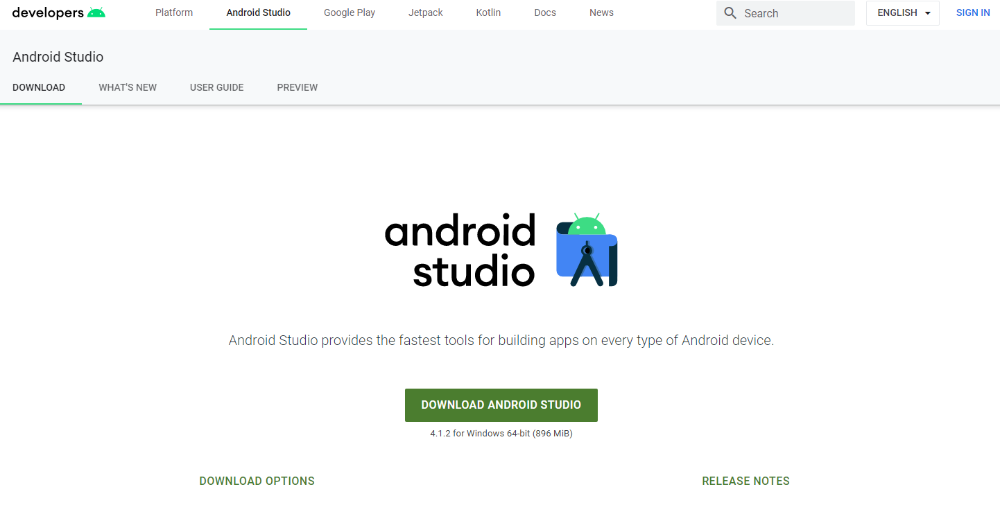
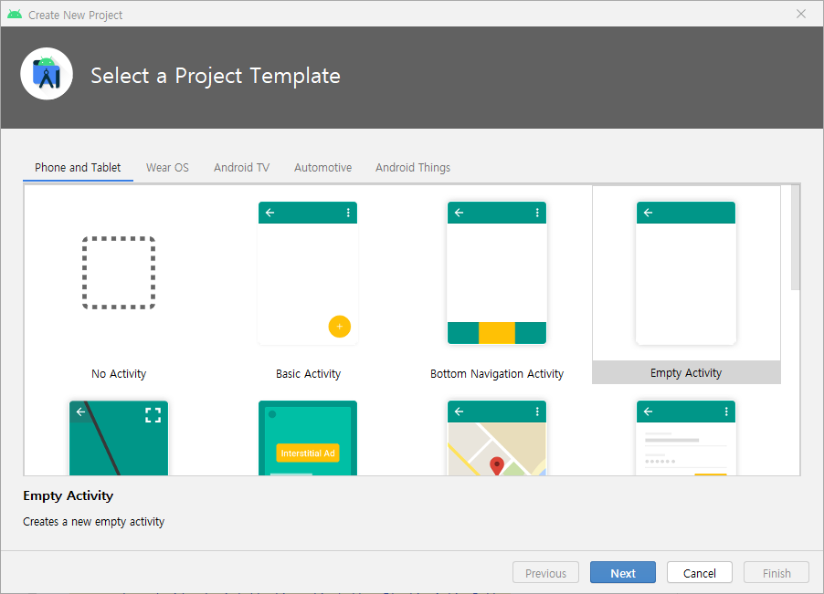
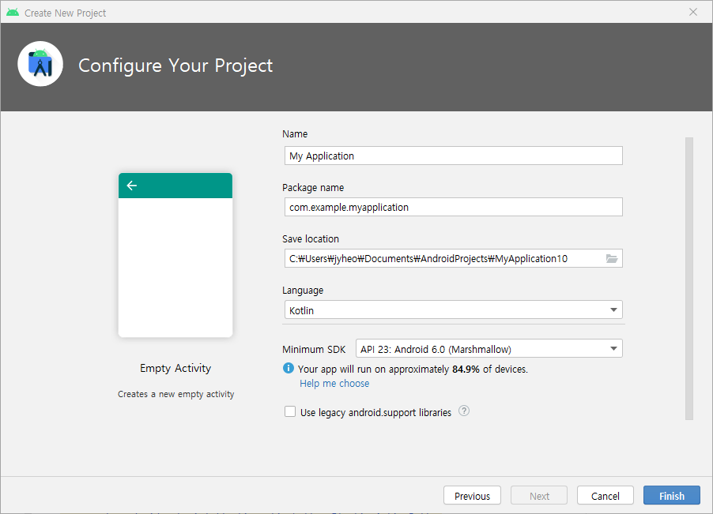
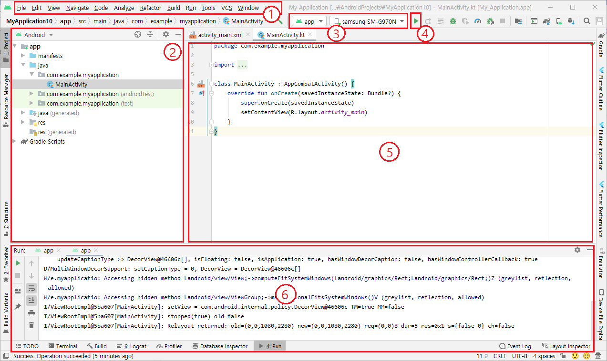
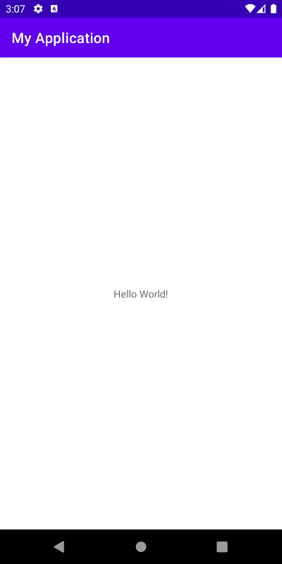
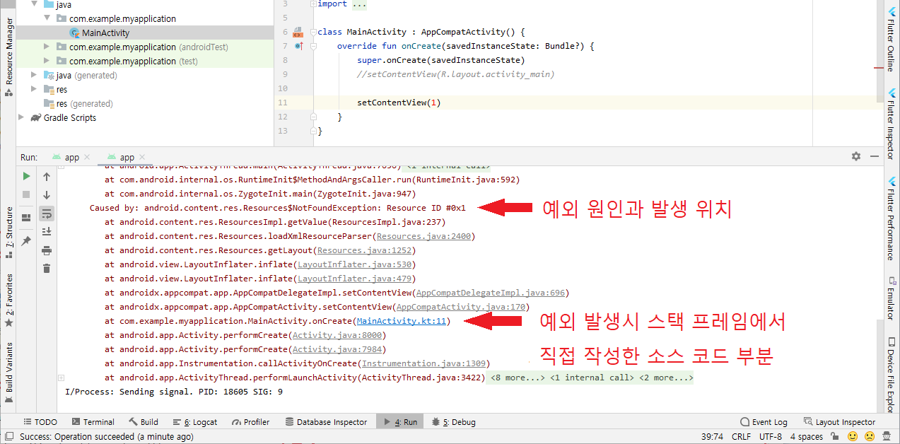
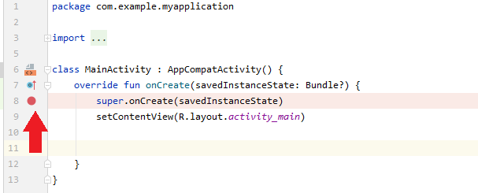
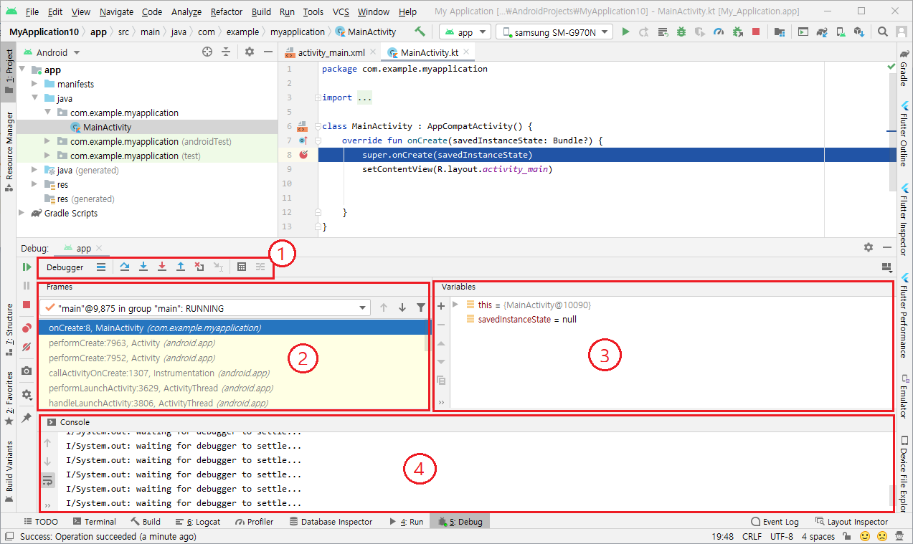

# 안드로이드 개요
<!-- _class: lead -->
### https://github.com/jyheo/android-kotlin-lecture

## 학습목표
  - 모바일 운영체제인 안드로이드의 특징과 구조를 설명할 수 있다.
  - 안드로이드 스튜디오를 다운로드하고 설치할 수 있다.
  - 안드로이드 스튜디오를 이용하여 프로젝트를 만들고 앱을 빌드하여 에뮬레이터에서 실행할 수 있다.
  - 안드로이드 스튜디오를 이용하여 디버깅을 할 수 있다.

## 모바일 환경 SW 개발
- 모바일 환경
  - 스마트폰: 대표적인 모바일 디바이스
  - 스마트폰을 이용하여 음악감상, 동영상 감상, 카메라 촬영 등의 다양한 작업이 가능
  - 스마트폰 제조사가 아닌 제3자가 개발한 응용 프로그램(일명 앱)을 추가 설치하여 더욱 많은 기능 제공
  - 다양한 모바일 디바이스: 태블릿, 스마트워치 등
- 모바일 환경 SW 개발의 발달 배경
  - 작은 부피로도 많은 데이터의 저장이 가능한 메모리
    - (최신 S21의 경우 메모리16G, 저장공간은 512G)
  - 프로세서 파워의 향상
  - 배터리 효율의 향상

<!-- _class: noslide -->
모바일 디바이스의 성능이 계속 발전하여 데스크톱 수준으로 향상되어, 다양한 앱의 개발이 가능해졌다. 모바일 GPU/NPU도 계속 발전하여 스마트폰에서도 고품질의 3D게임이나 비전/딥러닝 추론이 가능한 수준이다.

## 모바일 운영체제
- 스마트폰, 태블릿, 스마트워치 등과 같은 모바일 디바이스에서 실행되는 운영체제
- 모바일 하드웨어 자원을 직접 제어하고 관리하는 시스템 소프트웨어
- 데스크톱 운영체제와의 차이(점점 차이가 없어져가고 있음)
  - 배터리로 동작하기 때문에 에너지 소모 최적화
  - 한번에 하나의 작업(Task)을 처리하기 때문에 하나의 작업만 화면에 표시됨
- 대표적인 모바일 운영체제의 종류와 점유율 (2020년 기준)
  - 안드로이드 (Google) 72.48%
  - iOS (Apple) 26.91%
  - 출처: https://gs.statcounter.com/os-market-share/mobile/worldwide

## 안드로이드
- 스마트폰, 태블릿 등의 모바일 디바이스를 위한 모바일 운영체제
- 리눅스 커널을 기반으로한 소프트웨어 스택
  - C/C++ 라이브러리, 안드로이드 런타임, 응용 프레임워크(Application Framework)
- 오픈소스 프로젝트 (AOSP)
  - 구글은 AOSP를 기반으로 구글 버전 안드로이드를 출시함
  - AOSP를 기반으로한 다른 OS도 존재하지만 영향력은 크지 않음
  - https://source.android.com/index.html

## 안드로이드 버전 히스토리
- 2008년 9월 Android 1.0 (API level 1)출시
- **C**upcake, **D**onut, **E**clair, **F**royo, **G**ingerbread, **H**oneycomb(3.0)
- **I**cecream Sandwich, **J**ellybean, **K**itkat
- 2014년 11월 **L**ollipop 5.0-5.1, (API level 21,22) Dalvik -> ART, Material Design
- 2015년 10월 **M**arshmallow 6.0-6.01 (API level 23), 동적 권한
- 2016년 8월 **N**ougat 7.0-7.1.2 (API level 24-25)
- 2017년 8월 **O**reo 8.0-8.1 (API level 26-27)
- 2018년 8월 **P**ie 9.0 (API level 28)
- 2019년 9월 **Q** 10.0 (API level 29)
- 2020년 9월 **R** 11.0 (API level 30)

<!-- _class: noslide -->
안드로이드의 코드명은 알파벳 순으로 A부터 시작하여 현재 P인 Pie까지 출시되었다.
안드로이드는 오픈 소스 프로젝트이지만, 일반 삼성이나 LG와 같은 스마트폰 제조사에서는 안드로이드 오픈 소스를 기반으로 구글이 릴리즈하는 것을 사용한다.

또한 구글 플레이등을 이용하기 위해서는 구글이 릴리즈하는 버전을 사용해야 한다.

## 안드로이드 소프트웨어 스택
- 
  - 출처: https://source.android.com/images/android_framework_details.png

<!-- _class: noslide -->
안드로이드는 [리눅스 커널](https://ko.wikipedia.org/wiki/리눅스_커널)을 기반으로 동작한다. 리눅스 커널위에 커널과 분리되는 사용자 레벨 HAL계층이 있어서 제조사가 원하는 하드웨어 제어 소프트웨어를 GPL 라이선스를 침해하지 않고 추가할 수 있다.

안드로이드 런타임은 안드로이드 바이트 코드를 실행하는 가상 환경으로 Dalvik을 사용하다가 롤리팝(5.0) 이후부터 ART를 사용한다.

Native Libraries는 C/C++로 작성되어 컴파일된 라이브러리로 성능이 요구되는 멀티미디어, 데이터베이스(Sqlite), 웹 엔진(Webkit) 등이 있다.

Android Framework는 자바로 작성되어 안드로이드 런타임에 의해 실행되며 성능보다는 안드로이드 앱에 자바 언어로 API를 제공하여 응용 프로그램 개발을 쉽게 하는데 목적이 크다.

응용 프로그램, 안드로이드와 함께 릴리즈 되기도하며 구글 플레이 스토어나 기타 앱 마켓(국내는 원스토어, 삼성 마켓)을 통해 추가로 앱을 설치할 수 있다. 구글은 구글 플레이와 관련된 서브 시스템들을 제조사가 아닌 구글 플레이 스토어를 통해 업데이트하도록 하여 새로운 기능(구글 위치 서비스, 구글 클라우드 메시지 등)을 빠르게 업데이트할 수 있도록 하였다.

## 개발환경 설치
- Android Studio를 다운로드 하여 설치
  - https://developer.android.com/studio/
  

<!-- _class: noslide -->
예전에는 JDK를 별도로 설치하였으나, 이제는 Android Studio 설치 파일에 OpenJDK가 포함되어 있어서 별도로 설치할 필요가 없다.

안드로이드 앱은 일반적으로 코틀린이나 자바 언어를 이용하여 개발한다. 코틀린을 이용하면 훨씬 프로그래밍이 간편해지기 때문에 자바보다 코틀린이 더 많이 사용되는 추세이다.

성능이 요구되는 응용이나 라이브러리 개발을 위해 Native로 만들 수 있는 NDK도 제공한다. 이때는 C/C++언어로 프로그래밍한다.

## 안드로이드 스튜디오를 이용하여 앱 만들기 위한 프로젝트 생성
- Start a new Android Studio Project
  - Welcome to Android Studio 다이얼로그에서는 Create New Project 선택
  - 프로젝트가 열려 있는 상태에서는 File > New > New Project 선택
- Select a Project Template
    - Phone and Tablet 선택
    - Empty Activity 선택 

<!-- _class: noslide -->
만들려는 앱의 대상 디바이스 종류를 선택하고, 그 디바이스에 해당하는 앱 템플릿을 선택한다.

---

- Configure Your Project
    - Name: My Application
    - Save location: 적당한 위치를 선택
    - Minimum SDK: API 23 Android 6.0 (Marshmallow)
    - Finish 

<!-- _class: noslide -->
Name: 만들려는 앱 이름
Package name: 앱의 패키지 이름
Save location: 프로젝트가 저장될 폴더
Language: Kotlin 또는 Java (이 강의자료는 코틀린을 우선으로 함)
Minimum SDK: 만들려는 앱이 실행 가능한 안드로이드의 최소 버전, 이 버전이 낮으면 더 많은 안드로이드 기반 디바이스를 지원할 수 있지만 새로운 기능을 쓰기 어렵고, 반대로 높은 경우 최신 기능은 사용을 할 수 있지만 지원 가능한 디바이스의 수가 줄어든다. 선택한 버전에 따른 대략적 디바이스의 커버리지(%)가 표시된다. 2020년 12월 기준으로 API 23은 84.9%로 나온다.

UI와 관련된 최신 기능의 대부분은 androidx를 통해 지원하기 때문에 너무 낮은 API만 아니면 괜찮다.

---
- 

<!-- _class: noslide -->
프로젝트 파일이 생성되고, 생성된 프로젝트가 안드로이드 스튜디오에서 열린 화면이다.

(1)번 은 안드로이드 스튜디오의 메뉴이고, (2)는 현재 프로젝트에 포함된 파일들을 여러 형태로 보여주는 사이드바이다. 안드로이드 스튜디오는 파일을 보여주는 부분(5)과 그 주위로 여러 개의 사이드바를 표시할 수 있다. 이 사이드바들을 통해 빌드 결과를 보거나 실행 중 발생하는 로그를 볼 수도 있다. 화면 아래의 (6)이 실행 중 로그를 보여주는 사이드바이다.
(3)은 실행할 앱 모듈과 실행 타깃(에뮬레이터나 실제 디바이스)을 선택하는 툴바이다. 그리고 그 옆의 (4)는 실행 버튼으로 메뉴의 Run > Run 'app'과 동일한 기능을 수행한다. 

## 안드로이드 스튜디오를 이용하여 앱 실행하기(에뮬레이터)
- 앱을 실행하기 위한 안드로이드 에뮬레이터 만들기
  - 안드로이드 스튜디오 메뉴의 Tools > AVD Manager
  - AVD(Android Virtual Device) 매니저가 실행되면
  - Create Virtual Device... 버튼
  - Phone | Pixel 3 선택하고 Next 버튼
  - 'R' x86 선택하고 Next 버튼
  - Finish 버튼
- 생성한 앱을 에뮬레이터로 실행
  - 안드로이드 스튜디오 툴바에서 실행 타깃 에뮬레이터 선택
  - 안드로이드 스튜디오에서 메뉴의 Run > Run 'app'

## 안드로이드 스튜디오를 이용하여 앱 실행하기(실제 디바이스)
- PC에 해당 디바이스용 USB 드라이버 설치
  - https://developer.android.com/studio/run/oem-usb
  - Windows에서 개발할 경우만 USB 드라이버 설치가 필요함
- 디바이스와 PC를 USB케이블로 연결하고, 설정 변경하기
  - '환경설정(Settings) > 개발자 옵션(Developer Options)' 선택 후, **'USB 디버깅'** 허용
  - (개발자 옵션이 안보이는 경우) '환경설정(Settings) > 디바이스 정보' 선택 후, 빌드번호 정보를 손가락으로 7번 터치하면, '환경설정>개발자옵션' 메뉴가 나타남
- 생성한 앱을 실행
  - 안드로이드 스튜디오 툴바에서 실행 타깃 디바이스 선택
  - 안드로이드 스튜디오에서 메뉴의 Run > Run 'app'

## 안드로이드 스튜디오에서 디버깅
- 예외/오류가 발생한 경우 디버깅 방법
  - 예외가 발생하면 출력된 콜 스택을 보고 오류가 난 위치와 원인을 파악
  - 원인 파악이 안되면 오류가 난 위치 전에(위치도 모르겠으면 시작 부분에) 중단점(breakpoint)를 설정하고 디버그 모드로 실행
  - 중단점 부터 한 스텝씩 실행하며 오류 원인 파악
- 예외나 오류가 발생하지 않고 이상하게 동작을 함
  - 해당 부분에 중단점(breakpoint)을 설정하고 디버그 모드로 실행한 후 중단점에서 한 스텝씩 실행하며 변수 값을 확인

---
- 예외(exception) 발생 상황에서 오류 위치 파악
  - MainActivity.kt의 9번째 라인의 인자를 1로 바꾸고 실행(고의로 예외 발생 시킴)
  

<!-- _class: noslide -->
예외 메시지가 다른 로그와 섞여서 찾기 어려운 경우가 있는데, 디버그 모드로 실행해보면 쉽게 찾을 수 있다.

---
- 중단점 지정하고
  - 안드로이드 스튜디오에서 파일을 보여주는 부분(5)에서 라인 번호 옆에 마우스 클릭하면 중단점 토글이 가능
    
- 디버그 모드로 실행
  - 메뉴의 Run > Debug 'app'

---
- 

<!-- _class: noslide -->
(1)은 디버거의 step into, step over 등의 한 스텝씩 실행하는 기능 툴바이고
(2)는 현재 콜 스택 프레임을 나타내고
(3)은 변수 값을 볼 수 있는 창으로 변수를 추가할 수 있다. 소스 코드 보는 창에서도 변수 옆에 값이 표시가 되어 쉽게 알 수 있다.
(4)는 디버그 콘솔로 출력되는 로그를 확인할 수 있다.

## 요약
- 안드로이드 스튜디오 설치
- AVD 에뮬레이터 생성
- 프로젝트 생성과 앱 실행하기
- 안드로이드 스튜디오로 디버깅하기(**디버그 모드는 프로그래밍에서 필수 기능!**)