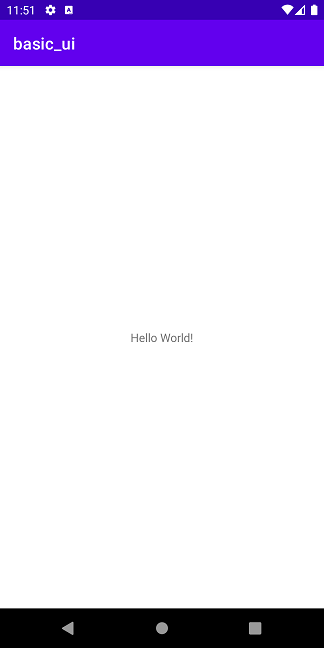
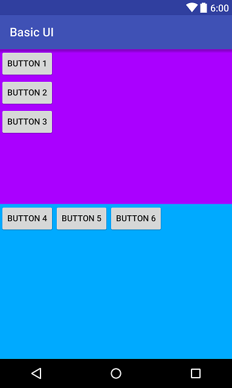
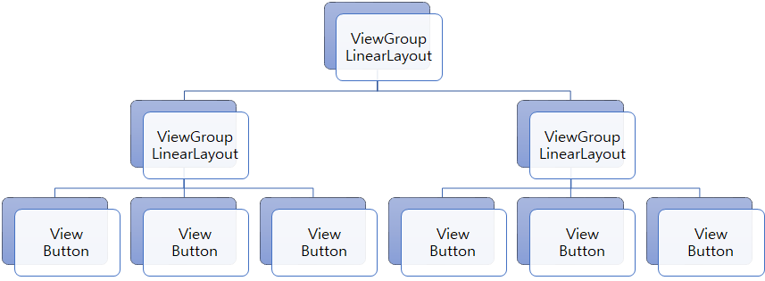
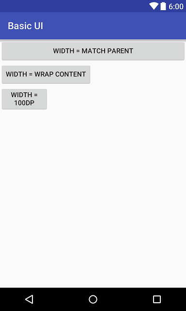
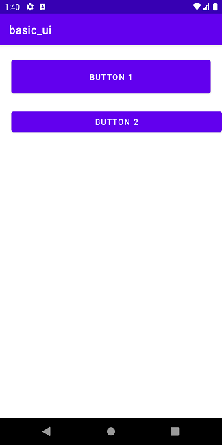
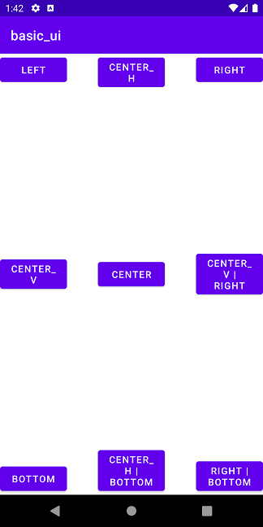

# 안드로이드 UI
<!-- _class: lead -->
### https://github.com/jyheo/android-kotlin-lecture


## 학습목표
- 위젯과 레이아웃의 의미를 설명할 수 있다.
- LinearLayout을 사용하여 UI를 구성할 수 있다.
- Margin, Padding, Gravity 속성을 이해하고 사용할 수 있다.
- 이벤트 리스너를 이해하고 클릭 이벤트 처리를 할 수 있다.


## 안드로이드 UI - 화면 크기를 고려한 디자인
- 기기마다 다른 크기, 해상도, 비율
  - 크기, 해상도에 따라 이미지 크기를 다르게 사용
  - 화면 크기, 비율에 따라 레이아웃을 다르게 구성
- 태블릿은 폰 보다 더 큰 화면
  - 더 많은 위젯를 포함할 수 있음
  - 화면 크기에 따라 위젯 크기도 자동으로 조정
  - 프래그먼트(Fragment) 활용
- 기기 방향 변화에 따른 디자인
  - 가로 보기와 세로 보기에 따라 다르게 디자인
  - 또는 방향을 고정하여 한가지만 디자인
- **UI를 구성하는 요소는 위젯과 레이아웃으로 나눌 수 있음**


## UI요소 - 위젯과 레이아웃
- 위젯
  - 정보를 출력, 입력 받기 위한 UI 구성 요소
  - TextView, Button, EditText, Checkbox 등
  - 주의: 안드로이드의 앱 위젯(App Widget)과는 다른 것임
- 레이아웃
  - 사용자 인터페이스에 대한 시각적 형태를 계층적 구조로 정의
    - 레이아웃(부모)과 포함되는 UI요소들(자식)을 부모-자식 관계로 나타내는 계층적 구조
    - 자식 UI요소 중에 레이아웃이 있을 수 있음(즉, 레이아웃 내에 다른 레이아웃이 중첩하여 존재할 수 있음)
  - XML 파일로 작성하고, 소스 코드에서 로드하여 사용함
  - LinearLayout, ConstraintLayout, FrameLayout, CoordinatorLayout, MotionLayout 등


앱 위젯(App Widget)은 안드로이드에서 홈화면에 배치하여 앱을 시작하지 않고도 정보를 빠르게 보거나 해당 앱으로 이동하게 해주는 것을 말한다. 보통 시계나 날씨, 검색 창 등을 앱 위젯으로 많이 사용한다.


## UI요소 - View 클래스
- UI요소(위젯, 레이아웃)들은 View를 상속하여 구현
  - 화면에 표시 가능한 사각형 영역
  - 각각의 뷰는 알아서 자신의 내용을 그리고, 이벤트(키보드, 마우스) 처리를 해결
- ViewGroup는 View이지만 다른 View를 포함할 수 있는 View
  - 레이아웃은 ViewGroup에 속함
- View의 속성이 곧 UI요소의 속성이 됨
  - android:visibility: 보이기 속성(Visible, Invisible, Gone)
  - android:layout_height, android:layout_width : 크기 속성
  - android:layout_margin: 외부 여백
  - android:layout_gravity: 위젯 위치 정렬
  - android:padding: 내부 여백
  - android:gravity: 내부 요소 정렬

android:visibility에서 Invisible은 해당 View를 안보이게 하고, Gone은 해당 View 자체를 레이아웃에서 제외한다.
android:layout_margin은 View의 외부 여백 크기를 지정한다. 즉 다른 인접한 View와의 간격을 조절할 수 있다.
android:layout_gravity는 View의 부모 View내에서의 위치를 지정한다. 부모 View에서 해당 View를 특정 위치로 정렬한다.
android:padding은 View 내부의 요소(글씨나 이미지, View 등)와 View 테두리의 여백 크기를 지정한다.
android:gravity는 View 내부의 요소(글씨나 이미지, View 등)를 특정 위치로 정렬한다.

기타 다른 View 속성도 많이 있다.
android:background는 배경색을 지정한다.


## UI요소 - 간단한 레이아웃과 위젯 예
- Android Studio에서 Empty Activity를 만들 때 자동으로 생성되는 레이아웃
  - app/src/main/res/layout/activity_main.xml
  ```xml
  →<androidx.constraintlayout.widget.ConstraintLayout 
      xmlns:android="http://schemas.android.com/apk/res/android"
      xmlns:app="http://schemas.android.com/apk/res-auto"
      xmlns:tools="http://schemas.android.com/tools" 
      android:layout_width="match_parent"
      android:layout_height="match_parent"
      tools:context=".MainActivity">
  →   <TextView
          android:layout_width="wrap_content"
          android:layout_height="wrap_content"
          android:text="Hello World!"
          app:layout_constraintBottom_toBottomOf="parent"
          app:layout_constraintLeft_toLeftOf="parent"
          app:layout_constraintRight_toRightOf="parent"
          app:layout_constraintTop_toTopOf="parent" />
  </androidx.constraintlayout.widget.ConstraintLayout>
  ```



레이아웃 시작과 끝 태그 사이에 배치하려는 UI요소(위젯이나 다른 하위 레이아웃)들을 넣는다. 위 예에서는 ConstraintLayout이고 그 안에 TextView 위젯이 하나 포함되어 있다.

시작 태그 안에 있는  xmlns는 XML 문서에서 요소(element)나 속성(attribute)의 이름들이 고유성을 갖도록 하기 위한 네임 스페이스(name space)를 지정하는 것이다.
xmlns:android의 속성 이름들은 android로 시작하는 android:layout_width와 같은 것들이고, xmlns:app는 app:layout_constraint... 등과 같은 속성이 해당된다.

tools 속성들은 실제로 레이아웃이 inflate(앱에서 xml을 읽어서 뷰를 만드는 과정)에 사용되는 것은 아니고, 안드로이드 스튜디오에서 편의 기능들을 지원하기 위한 것이다.

---
- 레이아웃 XML을 코틀린 코드에서 로드하여 사용하는 방법
  - app/src/main/.../MainActivity.kt
  ```kotlin
  class MainActivity : AppCompatActivity() {
      override fun onCreate(savedInstanceState: Bundle?) {
          super.onCreate(savedInstanceState)
  →       setContentView(R.layout.activity_main)
      }
  }
  ```
  - ```setContentView()``` 메소드에 해당 XML을 인자로 전달
  - ```R.layout.activity_main``` 은 앞의 app/src/main/res/layout/activity_main.xml 파일을 나타내는 상수 값으로 빌드할 때 자동으로 생성됨

MainActivity의 onCreate()는 일단은 main()함수 같이 프로그램의 시작 지점이라고 생각해두자.


## 위젯
  - TextView, EditText
  - Button
  - RadioButton, CheckBox, Switch
  - ImageView
  - WebView
  - ScrollView, NestedScrollView, ViewPager
  - Spinner, RecyclerView


## 위젯 - TextView와 EditText
- 기본적인 텍스트 표시/입력 뷰
- TextView – 사용자가 수정할 수 없으나 코드에서 텍스트를 변경할 수 있음
- EditText – 사용자가 입력 가능함
  - 


## 위젯 - Button
<!-- _class: noborder -->
- 일반적으로 많이 사용되는 푸시 버튼
- 버튼내에 텍스트, 아이콘을 표시할 수 있음
  - 버튼 전체를 이미지로 그리기 위해서는 ImageButton 사용
- 레이아웃 XML에 버튼 속성으로 onClick에 on-click 이벤트 핸들러를 지정할 수 있음
  - 


## 위젯 - CompoundButton
<!-- _class: noborder -->
- 두 개의 상태를 갖는 버튼
  - 체크/미체크, 온/오프
  - CompoundButton | 모양  
    -------------|------------------------------------
    ToggleButton | 
    Switch       | 
    CheckBox     | 
    RadioButtons | 


## 레이아웃 - LinearLayout
- LinearLayout(선형 레이아웃)
- 자식 UI요소들을 가로(horizontal) 방향 또는 세로(vertical) 방향으로 일렬로 배치하는 레이아웃
- 단순한 UI요소 배치에는 쉽게 사용할 수 있으나
- 복잡한 배치는 쉽지 않고, 레이아웃을 많이 중첩하게 되어 성능이 떨어짐
- 관련 속성
  - android:orientation - 배치 방향을 결정, vertical 또는 horizontal
  - android:layout_weight - 남는 공간을 자식 요소들에게 나누어줄 가중치 


## 레이아웃 - LinearLayout - Example
```xml
<LinearLayout xmlns:android="http://schemas.android.com/apk/res/android"
    android:layout_width="match_parent"
    android:layout_height="match_parent"
→   android:orientation="vertical">

    <LinearLayout
        android:layout_width="match_parent"
→       android:layout_height="0dp"
→       android:layout_weight="1"
→       android:orientation="vertical"
→       android:background="#aa00ff">
        <Button
            android:layout_width="wrap_content"
            android:layout_height="wrap_content"
            android:text="Button 1"
            android:id="@+id/button1"/>
        <Button
            android:layout_width="wrap_content"
            android:layout_height="wrap_content"
            android:text="Button 2"/>
        <Button
            android:layout_width="wrap_content"
            android:layout_height="wrap_content"
            android:text="Button 3"/>
    </LinearLayout>
```



이 레이아웃은 LinearLayout으로 두 개의 자식 LinearLayout을 가지고 있다. 각각의 자식 레이아웃은 세로 방향과 가로 방향으로 위젯을 배치하도록 되어 있다. 

첫 번째 자식 레이아웃의 android:orientation 속성이 vertical로 되어 있는데, 이는 자식 요소들(Button 1, 2, 3)을 세로로 배치함을 의미한다.

android:background는 해당 UI요소의 배경색을 지정한다.

그리고 두 자식 레이아웃의 세로 길이(layout_height)가 0으로 되어 있고 layout_weight가 똑같이 1로 되어 있다. layout_weight는 리니어 레이아웃에서 자식 UI요소들에게 남는 공간을 나눠주는 비율을 의미한다. 즉 여기에서는 둘다 1이기 때문에 똑같이 1:1로 나누어서, 결과적으로 동일한 공간을 갖게 된다.

---
```xml
    <LinearLayout
        android:layout_width="match_parent"
→       android:layout_height="0dp"
→       android:layout_weight="1"
→       android:orientation="horizontal"
→       android:background="#00aaff">
        <Button
            android:layout_width="wrap_content"
            android:layout_height="wrap_content"
            android:text="Button 4"/>
        <Button
            android:layout_width="wrap_content"
            android:layout_height="wrap_content"
            android:text="Button 5"/>
        <Button
            android:layout_width="wrap_content"
            android:layout_height="wrap_content"
            android:text="Button 6"/>
    </LinearLayout>

</LinearLayout>
```


두번째 자식 레이아웃의 android:orientation 속성이 horizontal로 되어 있는데, 이는 자식 요소들(Button 4, 5, 6)을 가로로 배치함을 의미한다.

https://github.com/jyheo/android-kotlin-lecture/blob/master/examples/basic_ui/app/src/main/res/layout/linear_layout.xml


---
- 앞의 LinearLayout Example의 UI 트리
  - 

<!-- _class: noborder -->


## UI 요소 크기
- UI 요소(레이아웃과 위젯)의 가로,세로 크기를 지정할 수 있음
- 가로 크기: layout_width
- 새로 크기: layout_height
- 크기 값으로 사용 가능한 것은
  - match_parent: 부모 UI요소 크기와 일치시킴
  - wrap_content: UI요소 내부의 내용 크기에 맞게 크기를 조절함
  - 특정 숫자 값: 예를 들어 300dp, 100px, 크기를 값에 따라 고정함
    - dp 단위 사용을 권장함

px는 픽셀을 나타내는 단위이다. 디바이스의 물리적 크기와 dpi(dots per inch)에 따라 실제로 보이는 크기가 다를 수 있다.

dp라는 단위는 dip라고도 하며 device independent pixel을 의미한다. 특정 디바이스의 해상도(resolution)에 상관 없이 UI요소의 크기를 나타내기 위한 것이다. 기준이 되는 디바이스는 160 dpi이다. 즉, px = dp * (dpi / 160)로 실제 디바이스 픽셀 수가 결정된다. 예를 들어 160 dpi 디바이스에서 320dp라고 하면 320px가 되는 것이고, 320 dpi 디바이스에서 320dp라고 하면 실제로 640px가 된다. dp를 사용하면, 디바이스의 물리적 크기가 비슷하다면 실제로 보이는 요소의 크기도 비슷하게 된다.

참고로, 텍스트 크기를 나타낼 때는 dp보다 sp를 권장한다. sp는 시스템의 글꼴 크기에 따라 크기가 변한다.


## UI 요소 크기 - Example

```xml
<LinearLayout 
    xmlns:android="http://schemas.android.com/apk/res/android"
    android:orientation="vertical" 
    android:layout_width="match_parent"
    android:layout_height="match_parent">

    <Button
→       android:layout_width="match_parent"
        android:layout_height="wrap_content"
        android:text="Width = Match Parent"/>
    <Button
→       android:layout_width="wrap_content"
        android:layout_height="wrap_content"
        android:text="Width = wrap content"/>
    <Button
→       android:layout_width="100dp"
        android:layout_height="wrap_content"
        android:text="Width = 100dp"/>

</LinearLayout>
```



여기에서 사용한 레이아웃은 LinearLayout으로 하위 UI요소들을 가로 또는 세로 방향으로 일렬로 배치하는 레이아웃이다.

https://github.com/jyheo/android-kotlin-lecture/blob/master/examples/basic_ui/app/src/main/res/layout/ui_component_size.xml


## Layout_Margin과 Padding
- Layout_Margin: View의 바깥 여백
- Padding: View의 내부 여백
  - 


## Layout_Margin과 Padding - Example

```xml
<LinearLayout xmlns:android="http://schemas.android.com/apk/res/android"
    android:layout_width="match_parent"
    android:layout_height="match_parent"
    android:orientation="vertical">

    <Button
        android:layout_width="match_parent"
        android:layout_height="wrap_content"
→       android:layout_margin="20dp"
→       android:padding="20dp"
        android:text="Button 1" />

    <Button
        android:layout_width="match_parent"
        android:layout_height="wrap_content"
→       android:layout_marginStart="20dp"
        android:text="Button 2" />

</LinearLayout>
```



layout_margin은 해당 뷰의 바깥쪽 여백을 지정하고 padding은 해당 뷰의 내부 여백을 지정한다.

Button1은 margin과 padding이 모두 20dp로 되어 있어 바깥 쪽 주변으로 20dp만큼 흰색 여백이 보이고, 내부의 글씨 주변으로 20dp만큼 여백이 있다. Button2와 비교해보면 버튼 크기가 더 두껍게 보이는데, 내부 여백때문이다.
Button2의 경우 marginStart만 20dp를 줬기 때문에 왼쪽 부분에만 바깐 여백이 20dp만큼 있다.
이렇게 margin이나 padding 속성을 줄 때 좌, 우, 위, 아래 모두 한번에 줄 수도 있고, marginStart, marginEnd, marginTop, marginBottom을 각각 지정할 수 도 있다.

좌, 우를 Start와 End로 표현하는 것은 한글이나 영어와 같이 왼쪽에서 오른쪽으로 읽는 언어의 경우이고 반대로 읽는 언어의 경우 Start와 End가 각각 우, 좌가 된다. 글씨 방향과 상관 없이 좌, 우를 나타내려면 Left와 Right를 사용하면 된다.

https://github.com/jyheo/android-kotlin-lecture/blob/master/examples/basic_ui/app/src/main/res/layout/layout_margin_padding.xml


## Layout_Gravity
- 부모 뷰 내에서 해당 뷰의 정렬 위치를 지정하는 속성
- LinearLayout/FrameLayout의 자식 뷰에서 layout_gravity 속성으로 흔히 사용
- 가능한 값들들
  - BOTTOM – 부모 뷰에서 아래쪽에 위치시킴
  - CENTER – 부모 뷰의 중앙에 위치시킴
  - CENTER_HORIZONTAL – 부모 뷰의 수평 기준으로 중앙에 위치시킴
  - CENTER_VERTICAL – 부모 뷰의 수직 기준으로 중앙에 위치시킴
  - END – 부모 뷰에서 텍스트 방향의 끝(한글이나 영어의 경우는 오른쪽)에 위치시킴
  - LEFT – 부모 뷰에서 왼쪽에 위치시킴
  - RIGHT – 부모 뷰에서 오른쪽에 위치시킴
  - TOP – 부모 뷰에서 위쪽에 위치시킴

layout_gravity는 개별 자식 뷰의 속성으로 지정하여, 각 자식 뷰의 부모 뷰 내에서의 위치를 결정하는 것이고,
gravity는 부모 뷰의 속성으로 지정하여, 자식 뷰 전체에 대해 위치를 결정하는 것이다.

---
```xml
<FrameLayout/>
    <Button android:layout_width="100dp" android:layout_height="wrap_content"
            android:text="Left"
            android:layout_gravity="left"/>
    <Button android:layout_width="100dp" android:layout_height="wrap_content"
            android:text="center_h"
            android:layout_gravity="center_horizontal"/>
    <Button android:layout_width="100dp" android:layout_height="wrap_content"
            android:text="right"
            android:layout_gravity="right"/>
    <Button android:layout_width="100dp" android:layout_height="wrap_content"
            android:text="center_v"
            android:layout_gravity="center_vertical"/>
    <Button android:layout_width="100dp" android:layout_height="wrap_content"
            android:text="Center"
            android:layout_gravity="center"/>
    <Button android:layout_width="100dp" android:layout_height="wrap_content"
            android:text="center_v | right"
            android:layout_gravity="center_vertical|right"/>
    <Button android:layout_width="100dp" android:layout_height="wrap_content"
            android:text="bottom"
            android:layout_gravity="bottom"/>
    <Button android:layout_width="100dp" android:layout_height="wrap_content"
            android:text="center_h | bottom"
            android:layout_gravity="center_horizontal|bottom"/>
    <Button android:layout_width="100dp" android:layout_height="wrap_content"
            android:text="right | bottom"
            android:layout_gravity="right|bottom"/>
</FrameLayout>
```



FrameLayout은 기본적으로 자식 UI요소를 모둔 왼쪽 위에 배치시키기 때문에 자식 UI요소에 layout_gravity 속성을 주지 않으면 왼쪽 위에 모든 자식 UI요소가 겹쳐서 배치된다.

https://github.com/jyheo/android-kotlin-lecture/blob/master/examples/basic_ui/app/src/main/res/layout/layout_gravity.xml


## 이벤트 리스너(Event Listeners)
- 이벤트를 처리할 콜백 메소드를 포함하는 인터페이스
- 사용자가 뷰를 사용하여 상호작용할 때 안드로이드 프레임워크에 의해 호출됨
  - 버튼을 눌렀을 때 처리
  - 리스트 뷰에서 항목을 선택했을 때 처리
    - 


## Event Listener Interface
- View.OnClickListener – 뷰를 클릭했을 때 콜백
- View.OnLongClickListener – 뷰를 오래 눌렀을 때(롱 클릭) 콜백
- View.OnFocusChangeListener – 뷰에 입력 포커스가 변경됐을 때 콜백
- View.OnKeyListener – 키를 눌렀을 때 콜백
- View.onTouchListener – 뷰를 터치했을 때, 땠을 때 등에 대한 콜백
- View.onCreateContextMenu – 롱 클릭으로 컨텍스트 메뉴가 생성될 때 호출되는 콜백 인터페이스

Click와 Touch의 차이? Click은 누른 상태에서 해당 View를 벗어나지 않고 릴리즈하면 발생하며 Touch는 누르는 순간 발생


## Event Listener Example

```kotlin 
class MainActivity : AppCompatActivity() {
    override fun onCreate(savedInstanceState: Bundle?) {
        super.onCreate(savedInstanceState)
        setContentView(R.layout.linear_layout)

→       val btn = findViewById<Button>(R.id.button1)

        // (1) by anonymous object
        btn?.setOnClickListener(object : View.OnClickListener {
            override fun onClick(v: View) {
                Snackbar.make(v, "Clicked!", Snackbar.LENGTH_SHORT).show()
            }
        })

→       // (2) by lambda
→       btn?.setOnClickListener {
→           Snackbar.make(it, "Clicked!", Snackbar.LENGTH_SHORT).show()
→       }
    }
}
```


Button1을 클릭하면 화면 아래 Clicked!라고 표시된 스낵바가 나타난다.

findViewById()는 해당 ID의 UI요소를 찾아서 해당 객체를 리턴하는 Activity의 메소드이다. 여기에서 R.id.button1은 앞의 리니어 레이아웃 예에서 Button 1의 android:id 속성이다.

findViewById()가 리턴한 Button 객체의 setOnClickListener() 메소드를 호출하여 View.OnClickListener 객체를 전달한다. 코틀린에서는 lambda함수를 이용한 SAM(Single Abstract Method)을 이용하면 (2)와 같이 간단히 할 수 있다.

https://github.com/jyheo/android-kotlin-lecture/blob/master/examples/basic_ui/app/src/main/res/layout/linear_layout.xml#L17

https://github.com/jyheo/android-kotlin-lecture/blob/master/examples/basic_ui/app/src/main/java/com/example/basic_ui/MainActivity.kt

