# Firebase
<!-- _class: lead -->
### Authentication
### 허준영(jyheo@hansung.ac.kr)


## 모바일 백앤드 서비스
- 모바일 앱이 기능의 일부나 데이터 저장을 원격 서버가 처리
    - 기계학습, 데이터베이스, 메시징 등
- 직접 서버를 설치하여 운영
    - 아파치 usergrid: http://usergrid.apache.org
- BaaS(Backend as a Service) 사용
    - Google의 백앤드 서비스 - Firebase
    - https://firebase.google.com


## Firebase 기능
- 앱 개발 -> 앱 개선 -> 비즈니스
- 앱 개발
    - Cloud Firestore, Realtime Database
    - Firebase ML -> ML Kit (https://developers.google.com/ml-kit)
    - Cloud Functions (Javascript/Typescript)
    - Authentication, Cloud Storage
- 앱 개선
    - Crashlytics, App Distribution, Performance Monitoring, Test Lab
- 비즈니스
    - Analytics, Cloud Messaging, In-App Messaging, Remote Config, Dynamic Links, App Indexing


## Firebase 시작하기
- 안드로이드 스튜디오의 Firebase Assistant를 이용한 사용방법
- Firebase Assistant 없이 수동 설정하여 사용하는 방법이 있음
- 전자 보다는 후자의 수동 방법을 권장함
    - Firebase Assistant를 이용할 때 간혹 연결 문제가 생기기도 하고,
    - 예제 코드가 최신 버전에 맞게 업데이트가 안되어 있기도 함
- 공통적으로 필요한 준비
    - 구글 계정 필요! 
    - 에뮬레이터 사용시 이미지는 Google Play 포함된 것으로!
- 최신 샘플 코드는 https://firebase.google.com/docs/guides 


## Firebase 시작하기1 - Firebase Assistant
- Android Studio, Firebase Services plugin 최신 버전으로 업데이트
- Tools > Firebase 메뉴 선택
    - 오른쪽 같은 Assistant가 생김
- Authentication 을 선택하고
    - Email and password authentication 선택
- 다른 기능도 동일하게 시작함


## Firebase 시작하기1 - Firebase Assistant
- Connect to Firebase 버튼, 권한 요청 페이지가 뜨면 '허용'
  


## Firebase 시작하기1 - Firebase Assistant
- 새 프로젝트 추가 하거나 기존 프로젝트에서 선택
- "Add project" 과정을 보임


## Firebase 시작하기1 - Firebase Assistant
 


## Firebase 시작하기1 - Firebase Assistant
 

## Firebase 시작하기1 - Firebase Assistant
- 안드로이드 스튜디오에서 Project 보기로 바꾼 후 app 폴더 밑에 보면
- google-services.json 이란 파일이 추가되었음  

- Connect 과정 완료


##  Firebase 시작하기1 - Firebase Assistant - Authentication
- Firebase Authentication 을 사용할 수 있도록 하기
- Add Firebase Authentication to your app 버튼
 


## Firebase 시작하기2 - 수동 설정
- Firebase 콘솔에 접속
    - https://console.firebase.google.com/
- 새 프로젝트 추가 하거나 기존 프로젝트에서 선택
- "Add project" 과정을 보임


## Firebase 시작하기2 - 수동 설정
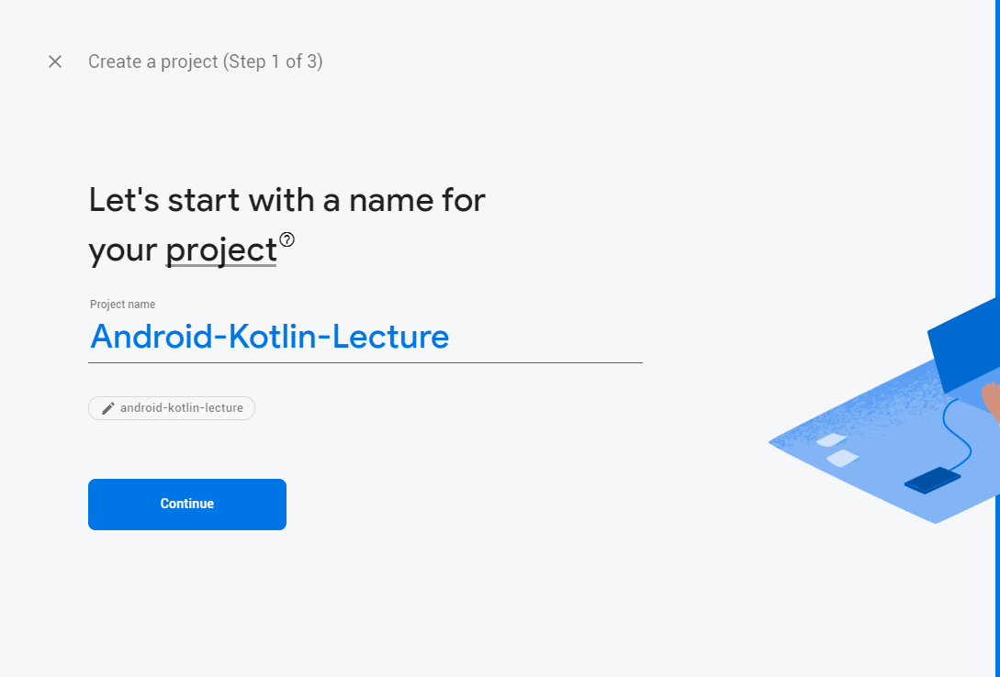


## Firebase 시작하기2 - 수동 설정


## Firebase 시작하기2 - 수동 설정


## Firebase 시작하기2 - 수동 설정
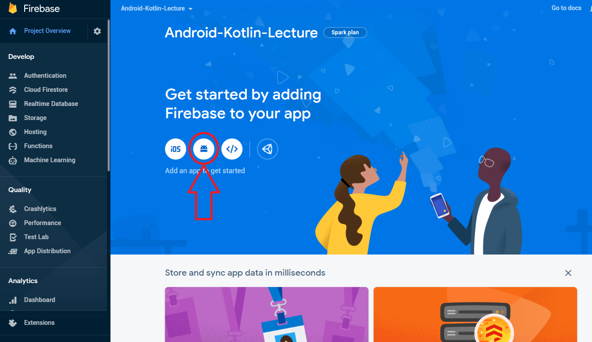


## Firebase 시작하기2 - 수동 설정
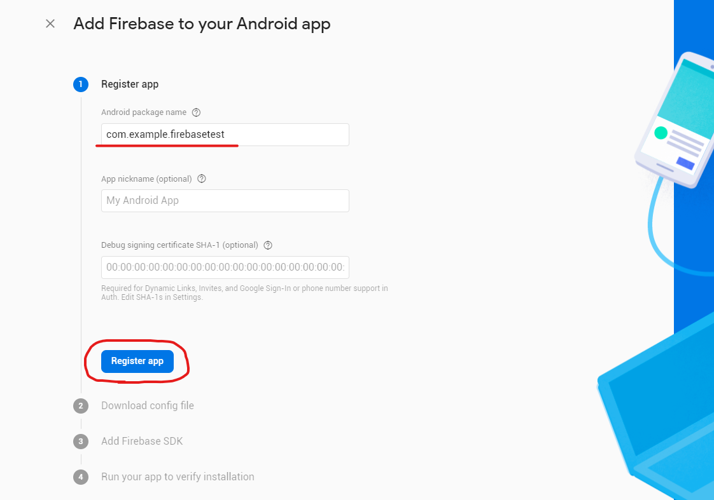

## Firebase 시작하기2 - 수동 설정
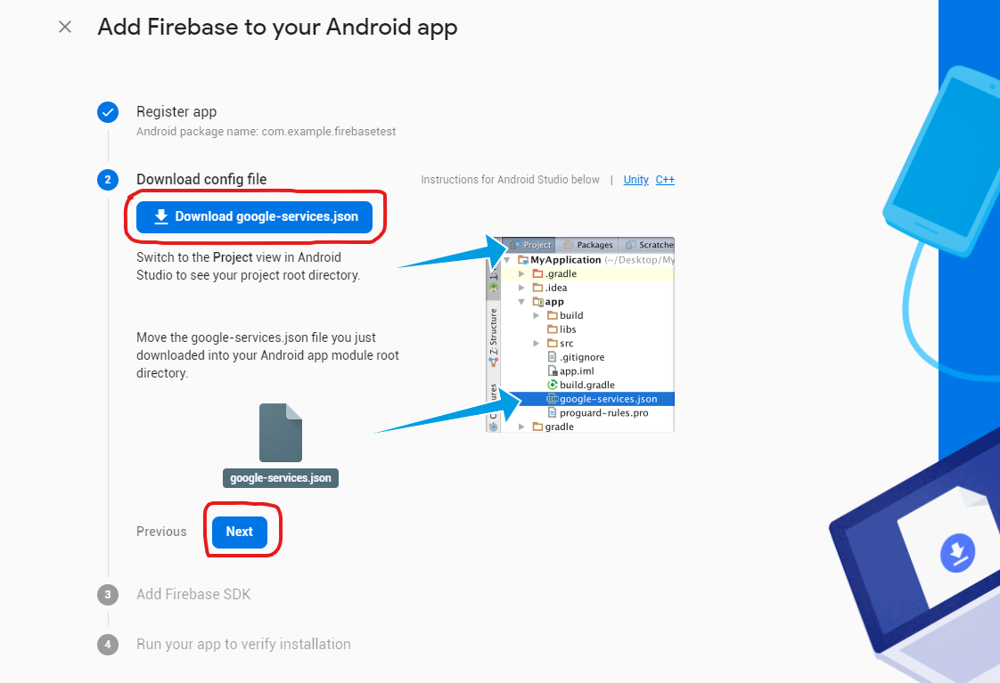


## Firebase 시작하기2 - 수동 설정
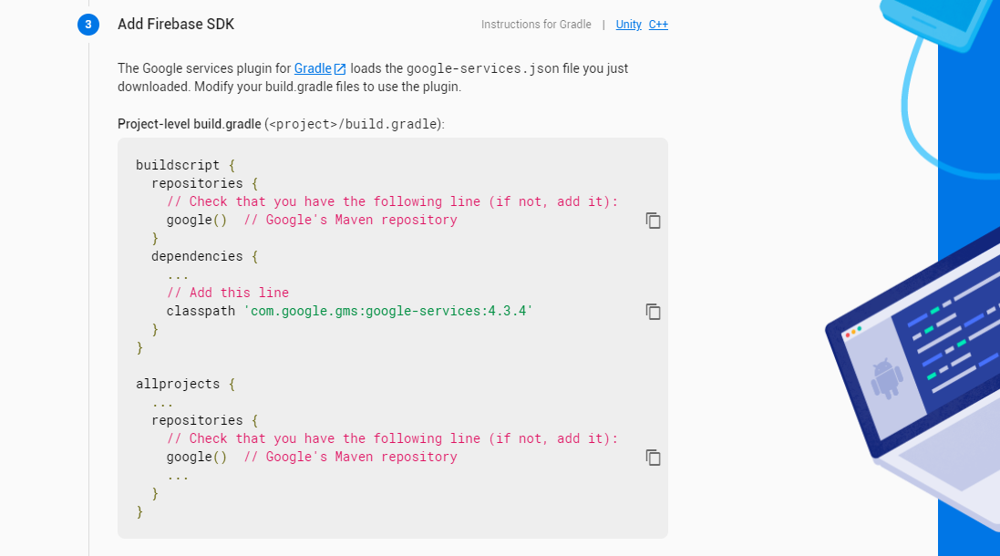

## Firebase 시작하기2 - 수동 설정
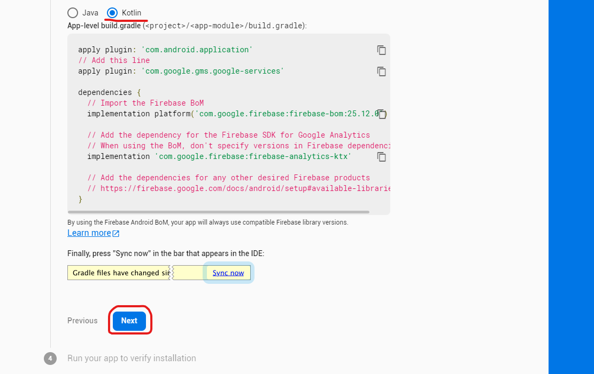

## Firebase 시작하기2 - 수동 설정
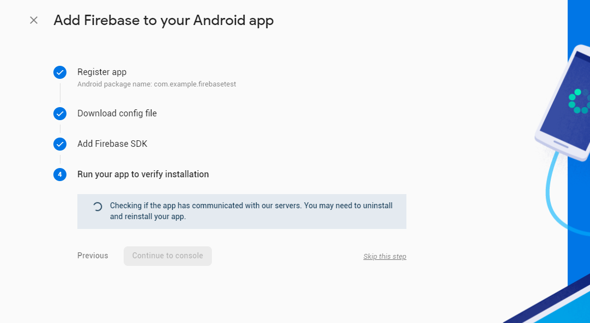
- 앱 실행

## Firebase 시작하기2 - 수동 설정
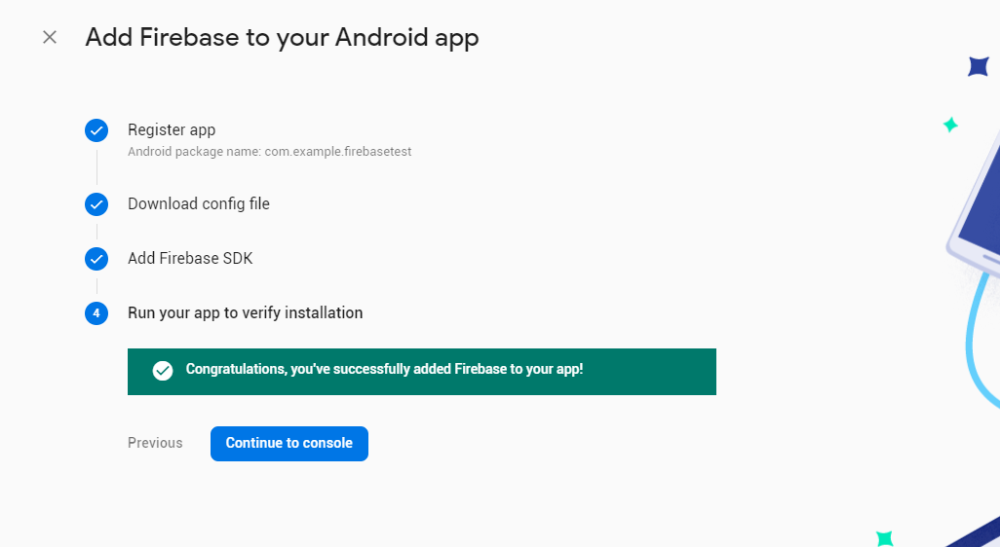


## Firebase 시작하기2 - 수동 설정 - Authentication
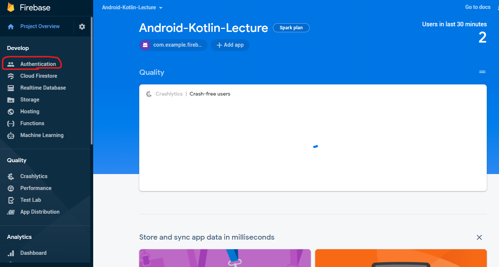

## Firebase 시작하기2 - 수동 설정 - Authentication

- 관련 개발 방법(SDK 설정, 코드 예제 등) 도움을 얻을 수 있음


## Firebase 시작하기2 - 수동 설정 - Authentication
- 앱 모듈 수준 build.gradle에 dependency 추가
```gradle
dependencies {
    // Import the BoM for the Firebase platform,  이미 앞에서 추가했음
    implementation platform('com.google.firebase:firebase-bom:25.12.0')

    // Declare the dependency for the Firebase Authentication library
    // When using the BoM, you don't specify versions in Firebase library dependencies
    implementation 'com.google.firebase:firebase-auth-ktx'
}
```
- Firebase-BoM은 여러 firebase 라이브러리들의 버전을 하나로 통일하기 쉬운 방법
- Firebase-Auth가 Authentication 라이브러리임


## Authentication - Firebase 안드로이드 Kotlin 코드
- 인증 객체 가져오기, 인증 상태 리스너
    ```kotlin
    class LoginActivity : AppCompatActivity() {

    lateinit var auth: FirebaseAuth
    lateinit var binding: ActivityLoginBinding

    override fun onCreate(savedInstanceState: Bundle?) {
        super.onCreate(savedInstanceState)
        binding = ActivityLoginBinding.inflate(layoutInflater)
        setContentView(binding.root)

        auth = Firebase.auth
    }
    ```


## Authentication - Firebase 안드로이드 Kotlin 코드
- 로그인 시작
    ```kotlin
    class LoginActivity : AppCompatActivity() {
        private lateinit var auth: FirebaseAuth

        override fun onCreate(savedInstanceState: Bundle?) {
            super.onCreate(savedInstanceState)
            val binding = ActivityLoginBinding.inflate(layoutInflater)
            setContentView(binding.root)

            auth = Firebase.auth

            binding.login.setOnClickListener {
                val userEmail = binding.username.text.toString()
                val password = binding.password.text.toString()
                auth.signInWithEmailAndPassword(userEmail, password)
                    .addOnCompleteListener(this) {
                        if (it.isSuccessful) {
                            startActivity(Intent(this, MainActivity::class.java))
                            finish()
                        } else {
                            Log.w("LoginActivity", "signInWithEmail", it.exception);
                            Toast.makeText(this, "Authentication failed.", Toast.LENGTH_SHORT).show();
                        }
                    }
            }
        }
    }
    ```

## Authentication - Firebase 안드로이드 Kotlin 코드
- 사용자 확인
    ```kotlin
    auth = Firebase.auth
    if (auth.currentUser == null) {  // 사용자 로그인 안된 상태
        startActivity(Intent(this, LoginActivity::class.java))  // 로그인 시작
        finish()
    }
    ```
- 로그 아웃
    ```kotlin
    Firebase.auth.signOut()
    ```


## Authentication - Firebase console 설정
- Firebase 콘솔에서 Email/Password 인증 활성화
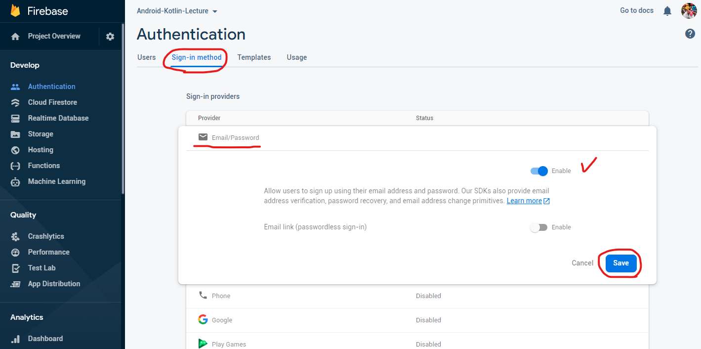


## Authentication - Firebase console 설정
- 테스트를 위해 콘솔에서 계정 추가 (https://console.firebase.google.com)
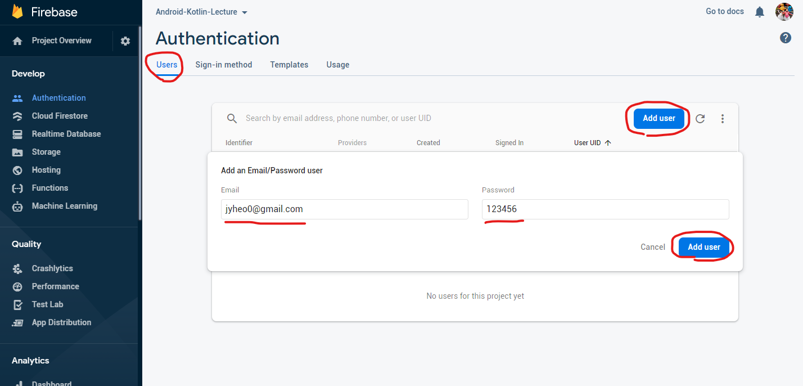


## Authentication - Firebase console 설정
- 사용자 추가 확인
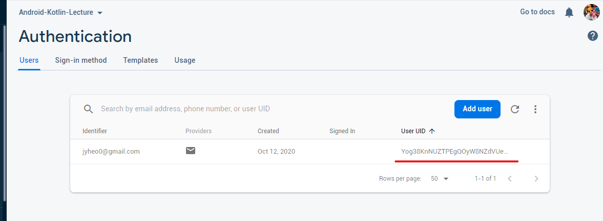
    - User UID는 Firebase.auth.currentUser?.uid 의 값과 같음


## Authentication
- 실행
    - 추가한 사용자 email/password로 로그인 성공하면
    - MainActivity에 User UID가 표시됨
    - MainActivity에서 Sing Out 버튼을 누르면 로그 아웃
- 전체 예제 코드
    - https://github.com/jyheo/android-kotlin-lecture/tree/master/examples/firebasetest

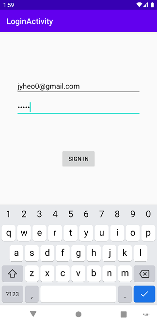


## 참고 - FirebaseUI
- FirebaseUI
    - https://firebase.google.com/docs/auth/android/firebaseui
- 다양한 소셜 로그인을 포함하는 액티비티를 제공
- startActivityForResult()로 시작하고 로그인 결과를 받아서 사용하면 됨


## 실습 
- 예제의 LoginActivity에 [Sign Up] 버튼 추가하고 버튼을 누르면 새로 계정을 생성하도록 한다.
    - 계정 생성이 성공하면 로그인 상태가 되기 때문에 Sing In과 마찬가지로 MainActivity를 시작함
- MainActivity에서 [Sing Out] 버튼을 누르면 로그아웃하도록 하고, LoginActivity를 시작하게 함
- 실행 결과 (예시 동영상 참고)
    - 실행하면 LoginActivity가 보이고,
    - 로그인이 성공하면 MainActivity에 User UID가 표시됨
    - 로그아웃을 하면 LoginActivity가 나타나게 하고,
    - 이번에는 Sing Up을 하여 계정을 새로 만들도록 한다.
    - Firebase 콘솔의 Authentication의 Users에서 추가된 사용자를 확인한다.
