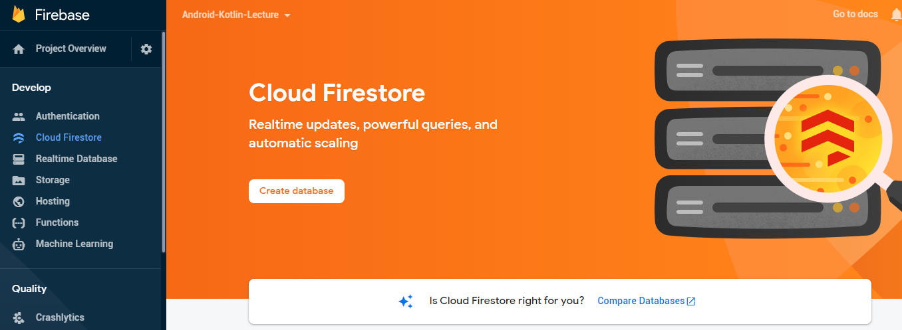
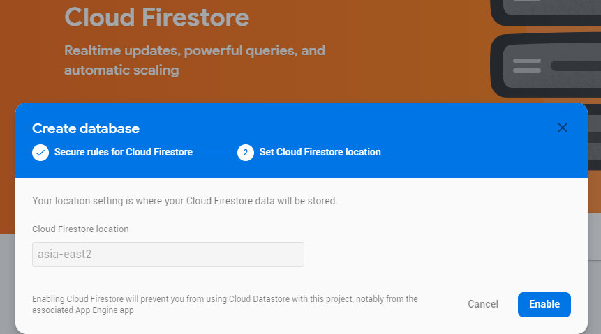
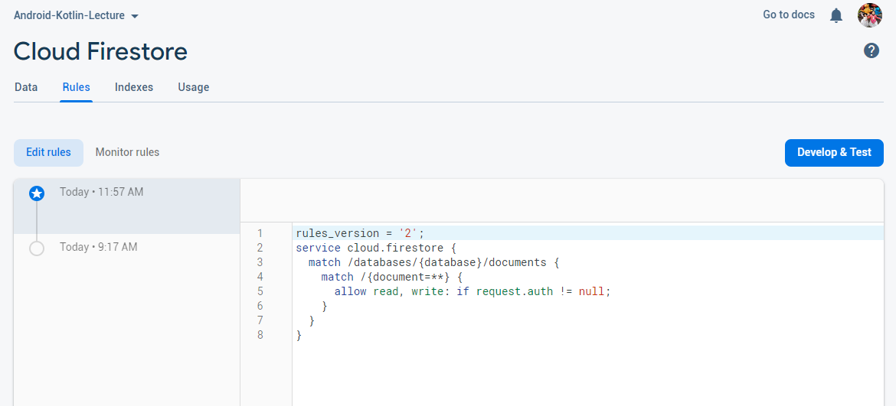
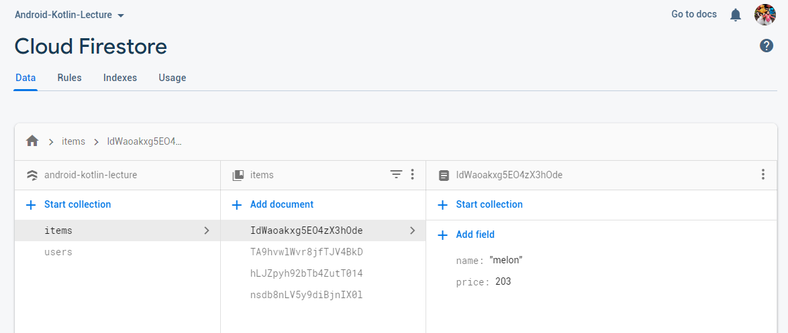
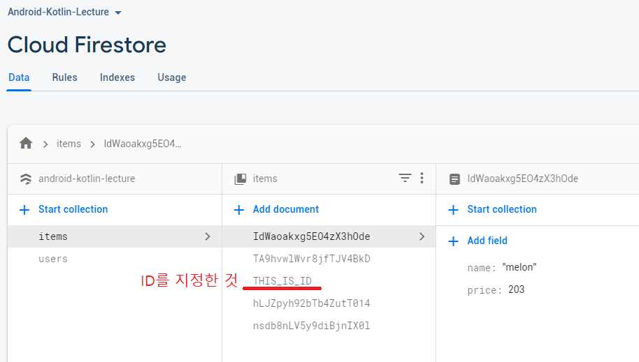
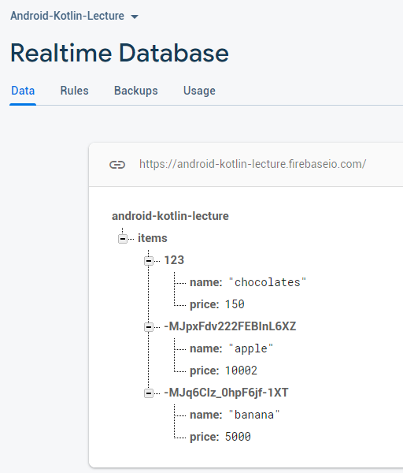
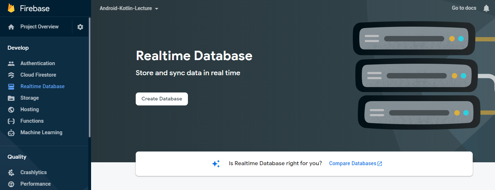
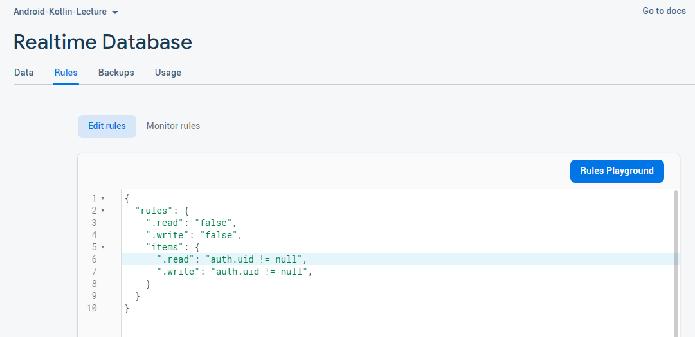

# Firebase Database
<!-- _class: lead -->
### Cloud Firestore, Realtime Database
### 허준영(jyheo@hansung.ac.kr)


## Firebase 설정
- 안드로이드 앱 개발 환경과 Firebase 연결이 완료된 상태에서 시작
    - 연결 방법은 Firebase-Auth 강의 자료 참고
        - build.gradle 설정
        - google-services.json 다운로드


## Cloud Firestore vs. Realtime Database
- Firebase는 두 가지 데이터베이스를 제공
- Realtime Database가 먼저 생긴 것으로 업데이트가 빈번하게 일어날 때 사용
    - 위치 추적 앱이나 실시간 메시징과 같은 것을 구현한다면 적합
    - 실제로 메시징은 Firebase Messaging을 사용하면 됨
- Cloud Firestore는 데이터가 규모가 크고, 업데이트가 덜 할 때 사용
    - 쇼핑몰 앱을 만든 다면 적합

# Cloud Firestore
<!-- _class: lead -->

## Cloud Firestore
- 특징
    - 유연하고 계층적 데이터 구조
    - 쿼리가 효율적
    - 실시간 업데이트
    - 오프라인 서포트
    - 스케일


## Cloud Firestore - Firebase Console
- https://console.firebase.google.com/
- 프로젝트 생성/선택하고 Cloud Firestore 선택



## Cloud Firestore - Firebase Console

- 테스트 모드로 선택, 나중에 security rule 추가


## Cloud Firestore - Firebase Console

- 서버 지역 선택, Storage에서 이미 선택한 경우 다시 선택 안됨


## Cloud Firestore - Firebase Console
- Rule

    - 인증된 사용자만 접근하도록 수정 ``` if request.auth != null ```


## Cloud Firestore
- Firestore는 계층적 데이터 구조를 사용, Collection과 Document
- Collection은 Document의 집합
- Document에는 Field(키와 값)들과 하위 Collection들의 집합
    - Field의 값으로 문자열, 정수, 실수, 배열, 맵 등이 사용 가능



## Cloud Firestore - 안드로이드 앱
- 앱 모듈 build.gradle
    ```gradle
    dependencies {
        // Import the BoM for the Firebase platform
        implementation platform('com.google.firebase:firebase-bom:25.12.0')

        // Declare the dependency for the Cloud Firestore library
        // When using the BoM, you don't specify versions in Firebase library dependencies
        implementation 'com.google.firebase:firebase-firestore-ktx'
    }
    ```

## Cloud Firestore - 안드로이드 앱 - 레퍼런스 객체
- Collection이나 Document에 대한 레퍼런스를 얻고,
- Collection 레퍼런스를 통해
    - Document 추가/삭제
- Document 레퍼런스를 통해
    - 필드 추가/변경/삭제
    - Collection 추가/삭제
```kotlin
val db: FirebaseFirestore = Firebase.firestore
val itemsCollectionRef = db.collection("items") // items는 Collection ID
```
- itemCollectionRef.document( **ID** ) 를 하면 items Collection 밑에 있는 Document에 대한 레퍼런스를 의미

## Cloud Firestore - 안드로이드 앱 - 레퍼런스 객체
- collection()과 document() 메소드를 레퍼런스에 적용하여 하위 데이터 레퍼런스를 얻거나
- 경로명을 써서 한번에 레퍼런스를 얻을 수 있음
- 다음 예는 동일한 데이터에 대한 레퍼런스임
    ```kotlin
    db.collection("test")
        .document("ID1")
        .collection("inventory")
        .document("ID1").get().addOnSuccessListener {
            Log.d(TAG, "${it.id}, ${it["name"]}, ${it["quantity"]}")
        }

    db.document("/test/ID1/inventory/ID1").get().addOnSuccessListener {
        Log.d(TAG, "${it.id}, ${it["name"]}, ${it["quantity"]}")
    }
    ```


## Cloud Firestore - 안드로이드 앱 - 데이터 추가
- Collection Ref에 add()나 set()으로 Document 추가
    ```kotlin
    val price = binding.editPrice.text.toString().toInt()
    val autoID = binding.checkAutoID.isChecked
    val itemID = binding.editID.text.toString()
    val itemMap = hashMapOf(
        "name" to name,
        "price" to price
    )
    if (autoID) {  // Document의 ID를 자동으로 생성
        itemsCollectionRef.add(itemMap)
            .addOnSuccessListener { updateList() 
            }.addOnFailureListener {  }
    } else {  // Document의 ID를 itemID의 값으로 지정
        itemsCollectionRef.document(itemID).set(itemMap)
            .addOnSuccessListener { updateList() 
            }.addOnFailureListener {  }
        // itemID에 해당되는 Document가 존재하면 내용을 업데이트
    }
    ```

## Cloud Firestore - 안드로이드 앱 - 데이터 추가
- 데이터 추가된 결과를 firebase console에서 확인



## Cloud Firestore - 안드로이드 앱 - 데이터 읽기
- Collection의 Document 모두 읽기
- 레퍼런스에 get() 메소드 이용
- 비동기 연산 결과를 리스너로 받음
    ```kotlin
    private fun updateList() {
        itemsCollectionRef.get().addOnSuccessListener { // it: QuerySnapshot
            val items = mutableListOf<Item>()
            for (doc in it) {
                items.add(Item(doc)) // Item의 생성자가 doc를 받아 처리
            }
            adapter?.updateList(items)
        }
    }
    ```

## Cloud Firestore - 안드로이드 앱 - 데이터 읽기
- Document의 필드 읽기
- 레퍼런스에 get() 메소드 이용
- 비동기 연산 결과를 리스너로 받음
    ```kotlin
    private fun queryItem(itemID: String) {
        itemsCollectionRef.document(itemID).get()
            .addOnSuccessListener { // it: DocumentSnapshot
                binding.editID.setText(it.id)
                binding.editItemName.setText(it["name"].toString())
                binding.editPrice.setText(it["price"].toString())
            }.addOnFailureListener {
            }
    }
    ```

## Cloud Firestore - 안드로이드 앱 - 데이터 변경
- Document 레퍼런스에 update(키, 값) 메소드로 변경
    ```kotlin
    private fun updatePrice() {
        val itemID = binding.editID.text.toString()
        val price = binding.editPrice.text.toString().toInt()

        itemsCollectionRef.document(itemID).update("price", price)
            .addOnSuccessListener { queryItem(itemID) }
    }
    ```

## Cloud Firestore - 안드로이드 앱 - 트랜잭션
- 트랜잭션 연산
    ```kotlin
    private fun incrPrice() {
        val itemID = binding.editID.text.toString()

        db.runTransaction { // it: Transaction
            val docRef = itemsCollectionRef.document(itemID)
            val snapshot = it.get(docRef)
            var price = snapshot.getLong("price") ?: 0
            // var price = snapshot["price"].toString().toInt()
            price += 1
            it.update(docRef, "price", price)
        }
            .addOnSuccessListener { queryItem(itemID) }
    }
    ```

## Cloud Firestore - 안드로이드 앱 - 데이터 삭제
- Collection 삭제는 권장하지 않음
- Document 레퍼런스에 delete() 메소드 호출하여 삭제
    - Document 삭제하더라도 하위 Collection은 삭제가 안됨
    ```kotlin
    private fun deleteItem() {
        val itemID = binding.editID.text.toString()

        itemsCollectionRef.document(itemID).delete()
            .addOnSuccessListener { updateList() }
    }
    ```
- Document의 필드를 삭제할 때는 update() 이용
    - 이 때 값을 ```FieldValue.delete()``` 로 지정


## Cloud Firestore - 안드로이드 앱 - 실시간 데이터 변경 추적
- Collection이나 Document가 변경되었을 때 리스너를 통해 알려줌
    - 다른 클라이언트가 변경했을 경우에도 실시간으로 알려줌
    ```kotlin
    // snapshot listener for all items
    snapshotListener = itemsCollectionRef.addSnapshotListener { snapshot, error ->
        binding.textSnapshotListener.text = StringBuilder().apply {
            for (doc in snapshot!!.documentChanges) {
                append("${doc.type} ${doc.document.id} ${doc.document.data}")
            }
        }
    }

    // sanpshot listener for single item
    itemsCollectionRef.document( Document ID ).addSnapshotListener { snapshot, error ->
        Log.d(TAG, "${snapshot?.id} ${snapshot?.data}")
    }
    ...
    snapshotListener?.remove()
    ```

## Cloud Firestore - 안드로이드 앱 - 데이터 조건 검색
- Collection에서 조건을 주고 Document를 검색
    ```kotlin
    private fun queryWhere() {
        val p = 100
        itemsCollectionRef.whereLessThan("price", p).get()
            .addOnSuccessListener {
                val items = arrayListOf<String>()
                for (doc in it) {
                    items.add("${doc["name"]} - ${doc["price"]}")
                }
                AlertDialog.Builder(this)
                    .setTitle("Items which price less than $p")
                    .setItems(items.toTypedArray(), { dialog, which ->  }).show()
            }
            .addOnFailureListener {
            }
    }
    ```

## Cloud Firestore - 안드로이드 앱 - 데이터 조건 검색
- 예제의 whereLessThan 외에도
    - whereEqualTo : ==
    - whereLessThanOrEqualTo : <=
    - whereGreaterThan : >
    - whereGreaterThanOrEqualTo : >=
    - whereNotEqualTo : !=
    - whereArrayContains : 필드 값이 배열이고, 필드에 특정 값 포함 여부
    - whereArrayContainsAny : 필드 값이 배열이고, 인자로 준 배열의 값 중 하나라도 포함하는지 여부
    - whereIn, whereNotIn : 필드 값이 인자로 준 배열에 포함 여부
- see more in [firebase.google.com](https://firebase.google.com/docs/firestore/query-data/queries?authuser=0)


## Cloud Firestore - 안드로이드 앱 - sort/limit/start,end
- Collection 레퍼런스에 orderBy()로 정렬
- Collection 레퍼런스에 limit()로 리턴 Document 수 제한
- 아래 예시는 name으로 정렬하고 3개까지 리턴
    ```kotlin
    itemsCollectionRef.orderBy("name").limit(3)
        .get()
    ```
- startAt(), startAfter(), endBefore(), endAt()
    - 쿼리에서 특정 값 또는 특정 Document 레퍼런스에서
    - 시작, 이후 부터 시작, 전까지, 까지
    ```kotlin
    itemsCollectionRef.orderBy("name").limit(3).get()
        .addOnSuccessListener { snapshots ->
            val lastRef = snapshots.documents[snapshots.size() - 1]
            itemsCollectionRef.orderBy("name").startAfter(lastRef).limit(3).get()  
        ...
    ```

## Cloud Firestore - 안드로이드 앱
- 예제 소스 코드 전체
    - https://github.com/jyheo/android-kotlin-lecture/blob/master/examples/firebasetest/app/src/main/java/com/example/firebasetest/FirestoreActivity.kt


# Realtime Database
<!-- _class: lead -->

## Realtime Database
- 연결된 모든 클라이언트들이 클라우드 데이터베이스와 싱크를 할 수 있음
- 오프라인이 되더라도 데이터베이스를 사용할 수 있음
- 데이터는 테이블이 아니라 JSON 트리 형태로 저장됨



## Realtime Database - Firebase Console
- https://console.firebase.google.com/
- 프로젝트 생성/선택하고 Realtime Database 선택



## Realtime Database - Firebase Console

- 테스트 모드로 선택, 나중에 security rule 추가


## Realtime Database - Firebase Console
- Rule

    - 전체는 기본적으로 접근 불가
    - items/ 밑의 데이터는 authentication 후에 접근 가능


## Realtime Database - 안드로이드 앱
- 앱 모듈 build.gradle
    ```gradle
    dependencies {
        // Import the BoM for the Firebase platform
        implementation platform('com.google.firebase:firebase-bom:25.12.0')

        // Declare the dependency for the Realtime Database library
        // When using the BoM, you don't specify versions in Firebase library dependencies
        implementation 'com.google.firebase:firebase-database-ktx'
    }
    ```

## Realtime Database - 안드로이드 앱 - 레퍼런스 가져오기
- Firebase.database.getReference( 경로명 )
    ```kotlin
    val database = Firebase.database
    val itemsRef = database.getReference("items")
    ```
    - 루트의 items에 대한 레퍼런스
- 레퍼런스의 child( 경로명 ) 메소드로 자식 노드의 레퍼런스 가져옴
    ```kotlin
    itemsRef.child("123").child("name")
    ```


## Realtime Database - 안드로이드 앱 - 데이터 쓰기
- 데이터베이스 레퍼런스를 가져와서 setValue()를 호출하여 씀
    ```kotlin
    val name = binding.editItemName.text.toString()

    val price = binding.editPrice.text.toString().toInt()
    val autoID = binding.checkAutoID.isChecked
    val itemID = binding.editID.text.toString()

    val itemMap = hashMapOf(  // 여러 자식(키,값)을 한번에 쓰기
        "name" to name,
        "price" to price
    )
    if (autoID) { // key를 자동으로 생성
        val itemRef = itemsRef.push()
        itemRef.setValue(itemMap)
    } else {  // 주어진 itemID로 키를 만듬
        val itemRef = itemsRef.child(itemID)
        itemRef.setValue(itemMap)
    }
    ```


## Realtime Database - 안드로이드 앱 - 데이터 읽기
- ValueEventListener를 등록, 해당 값이 변경될 때마다 알려줌
- ValueEventListener등록을 취소: removeEventListener()
    ```kotlin
    itemsRef.addValueEventListener(object : ValueEventListener {
        override fun onDataChange(dataSnapshot: DataSnapshot) {
            val items = mutableListOf<Item>()
            for (child in dataSnapshot.children) {
                items.add(Item(child.key ?: "", child.value as Map<*, *>))
            }
            adapter?.updateList(items)
        }
        override fun onCancelled(error: DatabaseError) {
            // Failed to read value
        }
    })
    ```

## Realtime Database - 안드로이드 앱 - 데이터 읽기
- ValueEventListener를 등록하고 한번만 알려주길 원하면 addListenerForSingleValueEvent()를 사용
    ```kotlin
    private fun queryItem(itemID: String) {
        itemsRef.child(itemID).addListenerForSingleValueEvent(object : ValueEventListener {
            override fun onDataChange(dataSnapshot: DataSnapshot) {
                val map = dataSnapshot.value as Map<*, *>
                binding.editID.setText(itemID)

                binding.editItemName.setText(map["name"].toString())
                binding.editPrice.setText(map["price"].toString())
            }
            override fun onCancelled(error: DatabaseError) {
                // Failed to read value
            }
        })
    }
    ```

## Realtime Database - 안드로이드 앱 - 데이터 쓰기/변경
- 업데이트 하려는 레퍼런스를 찾아서 setValue()
    - 해당 노드가 없으면 새로 만들게 됨
    ```kotlin
    val itemID = binding.editID.text.toString()
    val price = binding.editPrice.text.toString().toInt()

    itemsRef.child(itemID).child("price").setValue(price)
        .addOnSuccessListener { queryItem(itemID) }
    ```
- updateChildren() 으로 자식 키/값을 한번에 업데이트
    ```kotlin
    val itemMap = hashMapOf(
        "price" to price
    )
    itemsRef.child(itemID).updateChildren(itemMap as Map<String, Any>)
        .addOnSuccessListener { queryItem(itemID) }
    ```

## Realtime Database - 안드로이드 앱 - 데이터 삭제
- 삭제하려는 노드 레퍼런스 찾아서 removeValue()
    ```kotlin
    private fun deleteItem() {
        val itemID = binding.editID.text.toString()
        if (itemID.isEmpty()) {
            Snackbar.make(binding.root, "Input ID!", Snackbar.LENGTH_SHORT).show()
            return
        }
        itemsRef.child(itemID).removeValue()
            .addOnSuccessListener {  }
    }
    ```

## Realtime Database - 안드로이드 앱 - 트랜잭션
- 트랜잭션 처리, runTransaction()
```kotlin
private fun incrPrice() {
        val itemID = binding.editID.text.toString()
        if (itemID.isEmpty()) {
            Snackbar.make(binding.root, "Input ID!", Snackbar.LENGTH_SHORT).show()
            return
        }

        itemsRef.child(itemID).child("price")
            .runTransaction(object : Transaction.Handler {
            override fun doTransaction(mutableData: MutableData): Transaction.Result {
                var p = mutableData.value.toString().toIntOrNull() ?: 0
                p++
                mutableData.value = p
                return Transaction.success(mutableData)
            }

            override fun onComplete(
                databaseError: DatabaseError?,
                committed: Boolean,
                currentData: DataSnapshot?
            ) {
                // Transaction completed
                queryItem(itemID)
            }
        })
    }
```


## Realtime Database - 안드로이드 앱 - 데이터 정렬
- 데이터 정렬: orderByChild(), orderByKey(), orderByValue()
    ```kotlin
    val query = itemsRef.orderByChild("price")
    query.addValueEventListener(object : ValueEventListener {
        override fun onDataChange(dataSnapshot: DataSnapshot) {
            for (child in dataSnapshot.children) {
                println("${child.key} - ${child.value}")
            }
        }
        override fun onCancelled(error: DatabaseError) {
            // Failed to read value
        }
    })
    ```
- 결과 수 제한: limitToFirst(), limitToLast()
    ```kotlin
    val query = itemsRef.orderByChild("price").limitToFirst(100)
    ```

## Realtime Database - 안드로이드 앱
- 예제 소스 코드 전체
    -  https://github.com/jyheo/android-kotlin-lecture/blob/master/examples/firebasetest/app/src/main/java/com/example/firebasetest/RealtimeDBActivity.kt


## 실습
- Firebase Cloud Firestore를 이용하여 아래 요구사항을 구현
- 데이터베이스에는 상품(Items), 사용자(Users), 장바구니(Carts)
- MainActivity에는 장바구니 버튼과 상품 목록이 있음
- 상품 목록에서 상품을 선택하면 자세히 보기 액티비티(ItemActivity)
- ItemActivity에는
    - 상품 이름, 가격, 설명, 이미지(모든 상품이 같은 이미지여도 괜찮음)
    - 장바구니에 넣기 버튼
        - 장바구니 버튼을 누르면 장바구니에 상품 넣음
    - MainActivity로 되돌아가는 Up 버튼(ItemActivity의 parentActivityName을 MainActivity로 설정)
- MainActivity의 옵션 메뉴에서 장바구니를 선택하면 장바구나 액티비티(CartActivity) 시작
- CartActivity에는
    - 상품 이름, 가격, 삭제 버튼 목록을 보여줌
    - 삭제 버튼을 누르면 해당 상품을 장바구니에서 제거