# Firebase
<!-- _class: lead -->
### Crashlytics, Storage, RemoteConfig
### 허준영(jyheo@hansung.ac.kr)


## Firebase 설정
- 안드로이드 앱 개발 환경과 Firebase 연결이 완료된 상태에서 시작
    - 연결 방법은 Firebase-Auth 강의 자료 참고
        - build.gradle 설정
        - google-services.json 다운로드


## Firebase Crashlytics
- 앱이 비정상 종료되어을 때 예외 로그를 Firebase에 남기고 확인할 수 있게 해줌
- 프로젝트와 앱 모듈의 build.gradle 설정만 해주면 됨
- 프로젝트 build.gradle
    ```gradle
    buildscript {
        repositories {
            google()
        }

        dependencies {
            classpath 'com.google.gms:google-services:4.3.4'

            // Add the Crashlytics Gradle plugin (be sure to add version
            // 2.0.0 or later if you built your app with Android Studio 4.1).
            classpath 'com.google.firebase:firebase-crashlytics-gradle:2.3.0'
        }
    }
    ```

## Firebase Crashlytics
- 앱 모듈 build.gradle
    ```gradle
    apply plugin: 'com.google.firebase.crashlytics'

    dependencies {
        ...

        implementation platform('com.google.firebase:firebase-bom:25.12.0')
        implementation 'com.google.firebase:firebase-analytics-ktx'

        implementation 'com.google.firebase:firebase-crashlytics-ktx'
    }
    ```
- Gradle Sync 후에 앱 빌드하고 실행하면 됨
- 고의로 Exception을 발생하면 5분 내에 Crashlytics에서 확인 가능
    - 예를 들어 ``` setContentViwe(null) ```


## Firebase Crashlytics
- FIrebase Console에서 Crashlytics 확인
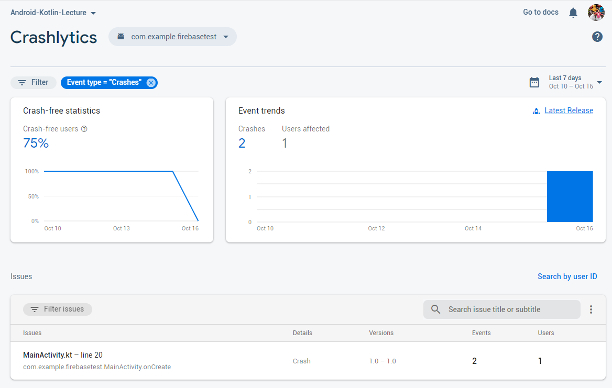

## Firebase Crashlytics
- FIrebase Console에서 Crashlytics 확인
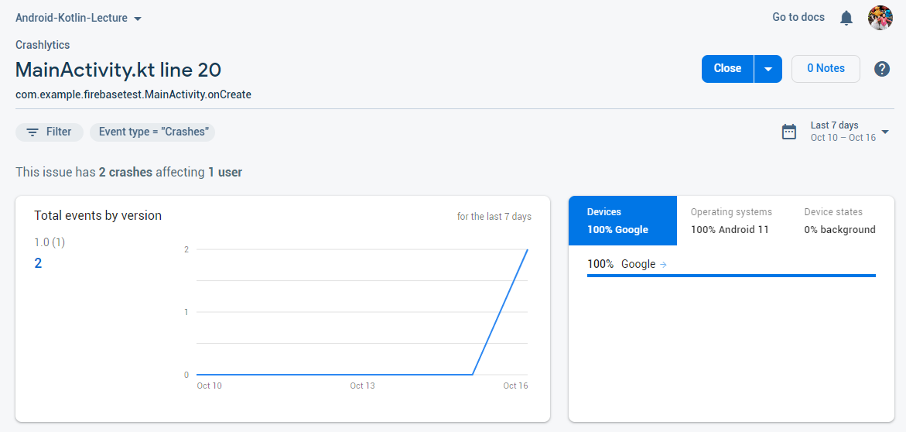


## Firebase Crashlytics
- FIrebase Console에서 Crashlytics 확인
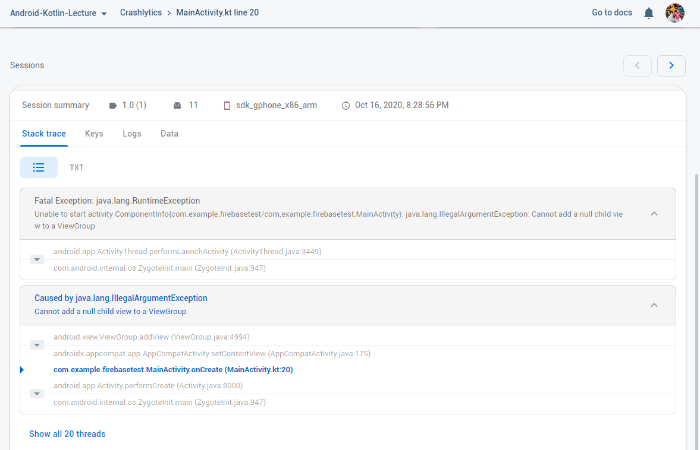


# Firebase Storage
<!-- _class: lead -->


## Storage
- 이미지, 오디오, 비디오, 사용자가 생성한 데이터 등을 저장하기 위한 공간
    - 유료로 사용하면 백업 기능도 제공
- Firebase 콘솔(https://console.firebase.google.com/)에서 프로젝트 선택
    - 안드로이드 앱 개발 환경과 Firebase 연결이 완료된 상태에서 시작
    - 연결 방법은 Firebase-Auth 강의 자료 참고
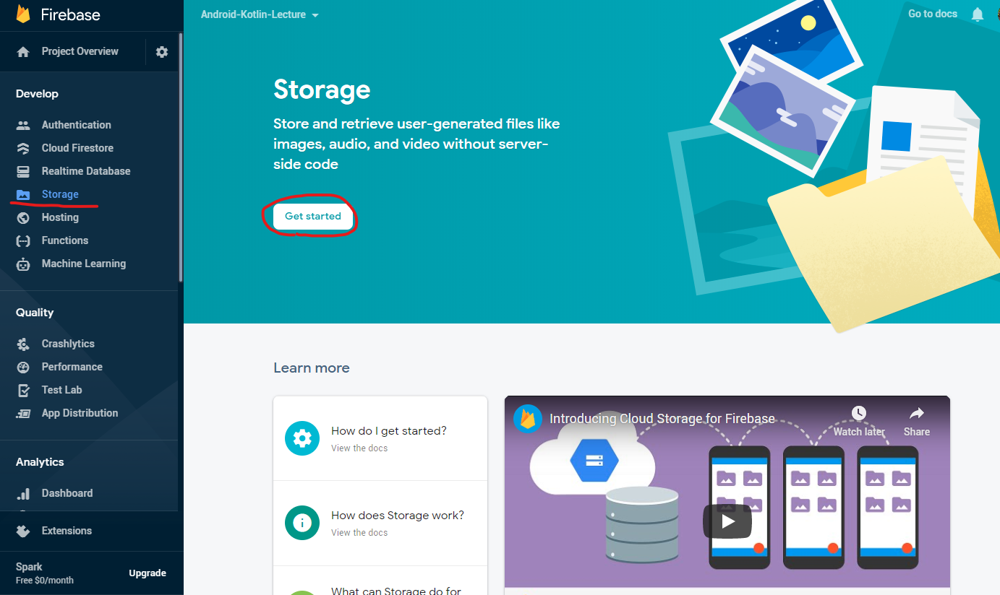


## Storage - Firebase Console
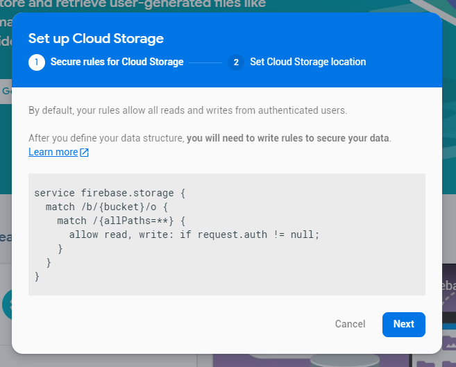 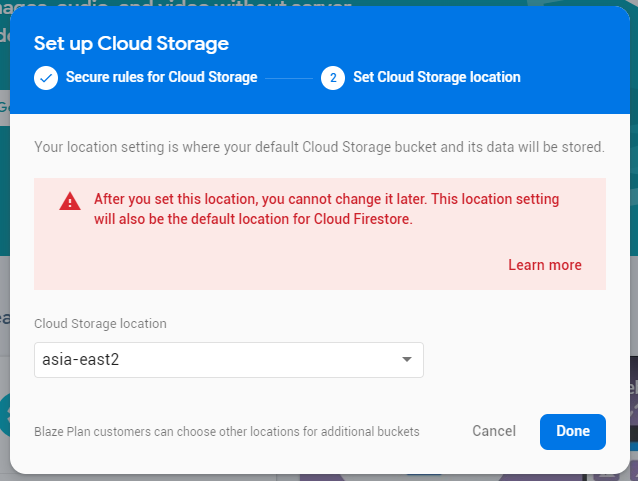
- 리전 선택, 나중에 변경이 불가함

## Storage - Firebase Console
- 콘솔에서 파일 업로드
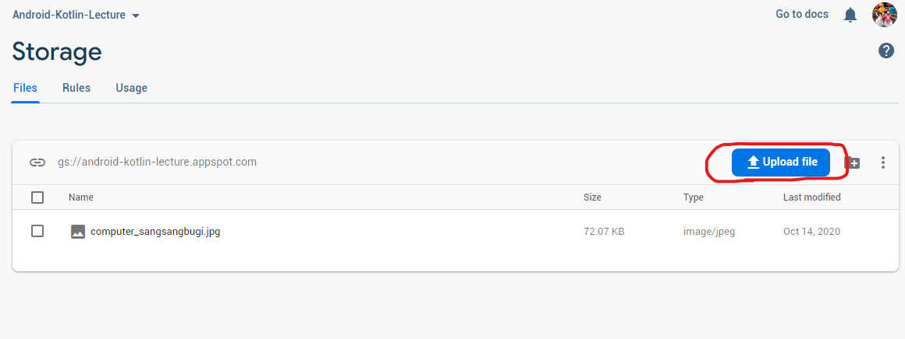

## Storage - Firebase Console
- 파일 상세 보기
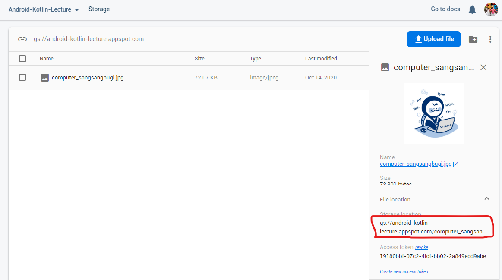


## Storage - Firebase Console
- 접근 규칙(Rules): 스토리지의 파일 접근 권한 설정
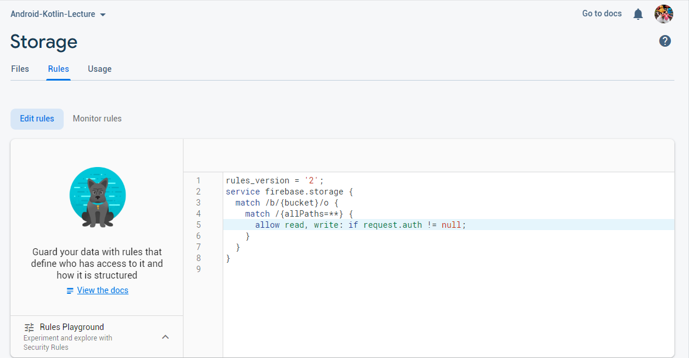


## Storage - Firebase Console
- 접근 규칙(Rules): 스토리지의 파일 접근 권한 기본 설정
    ```
    rules_version = '2';
    service firebase.storage {
        match /b/{bucket}/o {
            match /{allPaths=**} {
            allow read, write: if request.auth != null;
            }
        }
    }
    ```
    - 인증 후에 Storage에 접근이 가능함
    - ``` match 패턴 ``` 패턴에 맞는 경로에 대해 { } 안의 내용을 적용
    - 기본 버킷의 경로는 ``` /b/android-kotlin-lecture.appspot.com/o ``` 임
        - 따라서 위의 예는 기본 버킷 내의 모든 경로를 의미함 
    - ``` if request.auth != null ``` 를 제거하면 인증없이 접근 가능


## Storage - 안드로이드 앱
- 모듈의 build.gradle
    ```gradle
    dependencies {
        // Import the BoM for the Firebase platform
        implementation platform('com.google.firebase:firebase-bom:25.12.0')

        // Declare the dependency for the Cloud Storage library
        // When using the BoM, you don't specify versions in Firebase library dependencies
        implementation 'com.google.firebase:firebase-storage-ktx'
    }
    ```


## Storage - 안드로이드 앱
- 스토리지 객체 가져오기
```kotlin
class StorageActivity : AppCompatActivity() {
    lateinit var storage: FirebaseStorage
    lateinit var binding: ActivityStorageBinding

    override fun onCreate(savedInstanceState: Bundle?) {
        super.onCreate(savedInstanceState)
        binding = ActivityStorageBinding.inflate(layoutInflater)
        setContentView(binding.root)

        Firebase.auth.currentUser ?: finish()  // if not authenticated, finish this activity

        storage = Firebase.storage
```
- Firebase 인증이 된 경우에만 Storage에 접근하도록 Rule이 설정되어 있기 때문에
    - 인증이 안된 경우에는 종료하도록 함


## Storage - 안드로이드 앱
- 스토리지의 레퍼런스 객체
    ```kotlin
    val storageRef = storage.reference // reference to root
    val imageRef1 = storageRef.child("images/computer_sangsangbugi.jpg")
    val imageRef2 = storage.getReferenceFromUrl(
        "gs://android-kotlin-lecture.appspot.com/images/computer_sangsangbugi.jpg"
    )
    ```
    - ```.child(경로) ``` : 현재 위치에서 하위 디렉토리의 상대 경로에 대한 레퍼런스
    - ```.parent ``` : 현재 위치에서 부모 디렉토리에 대한 레퍼런스


## Storage - 안드로이드 앱
- 스토리지에서 이미지 가져와서 표시하기
    ```kotlin
    private fun displayImageRef(imageRef: StorageReference?, view: ImageView) {
        imageRef?.getBytes(Long.MAX_VALUE)?.addOnSuccessListener {
            val bmp = BitmapFactory.decodeByteArray(it, 0, it.size)
            view.setImageBitmap(bmp)
        }?.addOnFailureListener {
            // Failed to download the image
        }
    }
    ```


## Storage - 안드로이드 앱
- 스토리지에 파일 업로드
    ```kotlin
    private fun uploadFile(file_id: Long?, fileName: String?) {
        file_id ?: return
        val contentUri = ContentUris.withAppendedId(
            MediaStore.Images.Media.EXTERNAL_CONTENT_URI, file_id)

        val imageRef : StorageReference? = storage.reference.child("업로드 경로/파일명")
        imageRef?.putFile(contentUri)?.addOnCompleteListener {
            if (it.isSuccessful) {
                // upload success
                Snackbar.make(binding.root, "Upload completed.", Snackbar.LENGTH_SHORT).show()
            }
        }
    }
    ```
    - 이 예제에서 file_id와 fileName은 contentResolver를 사용하여 MediaStore.Images 에서 가져온 것
    - [firebasetest/StorageActivity.kt](https://github.com/jyheo/android-kotlin-lecture/blob/master/examples/firebasetest/app/src/main/java/com/example/firebasetest/StorageActivity.kt) 의 uploadDialog() 참조


##  Storage - 안드로이드 앱
- 전체 예제 코드
    - https://github.com/jyheo/android-kotlin-lecture/tree/master/examples/firebasetest

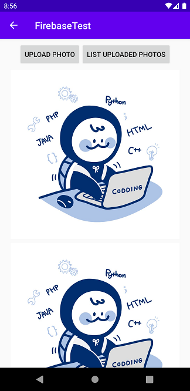 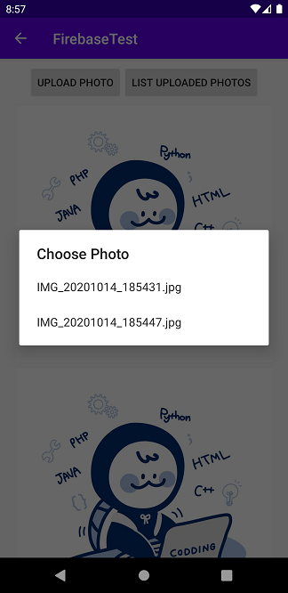


# Firebase Remote Config
<!-- _class: lead -->

## Remote Config
- 설정을 원격 클라우드(Firebase 서버)에서 가져와서 설정에 따라 앱의 동작을 다르게 할 수 있음
    - Firebase 콘솔에서 설정을 변경하고
    - 앱에서 변경된 설정을 주기적으로 가져옴


## Remote Config - Firebase Console
- 콘솔에서 설정 추가/변경
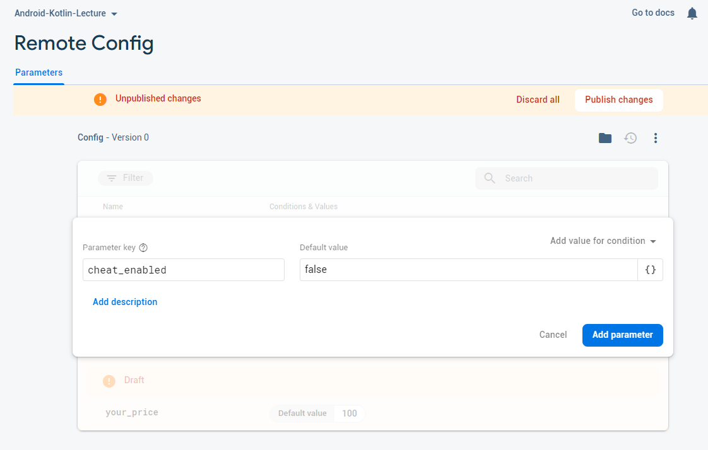


## Remote Config - Firebase Console
- 콘솔에서 설정 추가/변경
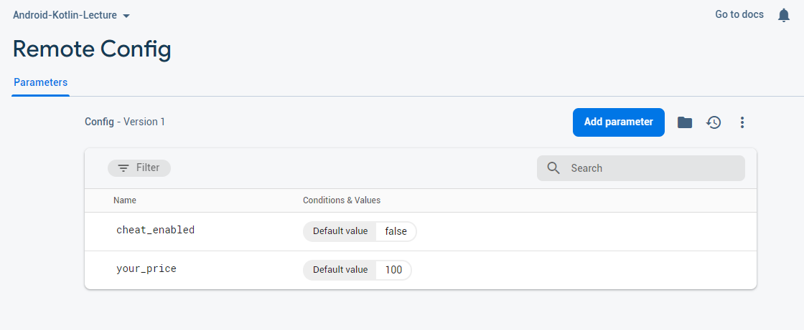


## Remote Config - 안드로이드 앱
- 모듈의 build.gradle
    ```gradle
    dependencies {
        // Import the BoM for the Firebase platform
        implementation platform('com.google.firebase:firebase-bom:25.12.0')

        // Declare the dependencies for the Remote Config and Analytics libraries
        // When using the BoM, you don't specify versions in Firebase library dependencies
        implementation 'com.google.firebase:firebase-config-ktx'
    }
    ```


## Remote Config - 안드로이드 앱
- 기본 설정 파일 만들기
    - New > Android Resource File
    - R.xml.remote_config_defaults
    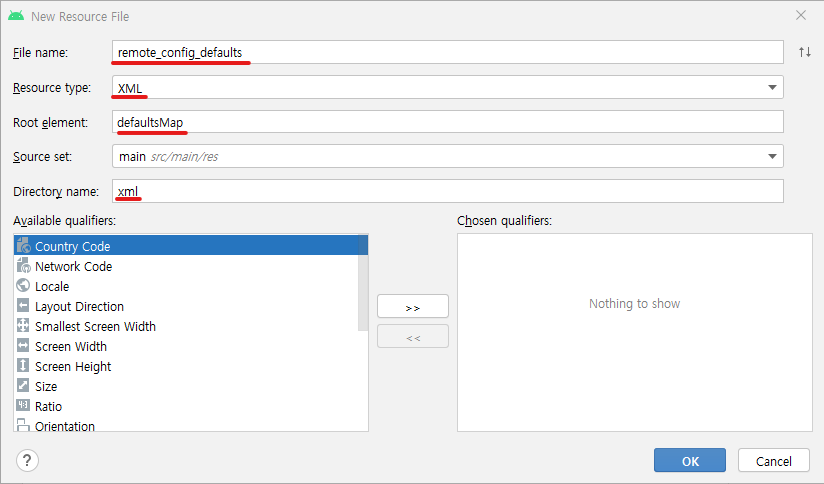


## Remote Config - 안드로이드 앱
- res/xml/remote_config_defaults.xml
    ```xml
    <?xml version="1.0" encoding="utf-8"?>
    <defaultsMap xmlns:android="http://schemas.android.com/apk/res/android">
        <entry>
            <key>your_price</key>
            <value>100</value>
        </entry>
        <entry>
            <key>cheat_enabled</key>
            <value>false</value>
        </entry>
    </defaultsMap>
    ```


## Remote Config - 안드로이드 앱
- Firebase.remoteConfig
    ```kotlin
    val remoteConfig = Firebase.remoteConfig
    val configSettings = remoteConfigSettings {
        minimumFetchIntervalInSeconds = 1 // For test purpose only, 3600 seconds for production
    }
    remoteConfig.setConfigSettingsAsync(configSettings)
    remoteConfig.setDefaultsAsync(R.xml.remote_config_defaults)
    ```
    - minimumFetchIntervalInSeconds: Firebase 서버에서 마지막으로 설정을 가져온 이후 최소 이 시간이 지나야 서버에 다시 요청함
    - setDefaultsAsync() : 로컬에 저장된 기본 값, 서버에서 설정을 가져오지 않았을 때는 이 값을 사용하게 됨


## Remote Config
- Firebase 서버에서 설정 가져와서 적용
- 적용된 설정 값을 읽기
    ```kotlin
    remoteConfig.fetchAndActivate()
                .addOnCompleteListener(this) {
                    val your_price = remoteConfig.getLong("your_price")
                    val cheat_enabled = remoteConfig.getBoolean("cheat_enabled")
                    binding.textYourPrice.text = your_price.toString()
                    binding.textCheatEnabled.text = cheat_enabled.toString()
                }
    ```
    - getLong, getBoolean 등의 메소드에 키를 주고 값을 리턴 받음


## Remote Config
- [Fetch and Activate] 버튼을 누르면 ```remoteConfig.fetchAndActivate()``` 를 호출
- 설정 값을 읽어서 텍스트 뷰에 표시함
    - ``` remoteConfig.getLong("your_price") ```
    - ```remoteConfig.getBoolean("cheat_enabled")```

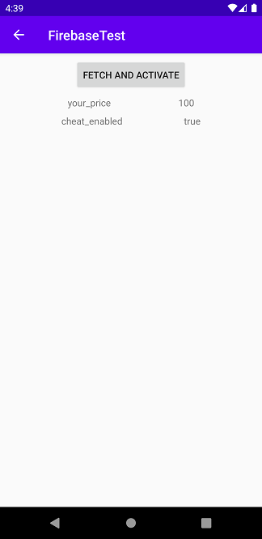


## 실습
- Remote Config에 season 키를 추가
    - 값으로는 spring, summer, fall, winter
- 액티비티가 시작되면
    - season에 따라 계절 그림을 Storage에서 받아서 액티비티에 표시
    - Refresh 버튼을 누르면 season 값에 따라 그림을 업데이트함
- Storage에 접근하기 위해 인증(로그인) 필요하도록 Rule 작성하고 인증도 포함시키는 것을 권장함
- 무료 이미지(저작권 문제 없음)
    - https://gongu.copyright.or.kr/gongu/main/main.do
- 제출은 액티비티.kt 파일(zip으로 압축)과 실행 동영상만 제출