# Flutter 
<!-- _class: lead -->
### 허준영(jyheo@hansung.ac.kr)


## Flutter 개요
- 모바일, 웹, 데스크톱 응용 프로그램을 위한 UI 툴킷
- 하나의 코드로 다양한 플랫폼 지원
- Android, iOS
- Web (Beta), Desktop (Alpha)
- 특징
    - 빠른 개발
    - 네이티브로 컴파일되어 성능 우수
    - Dart라는 언어로 작성

## 개발환경 설치
- 윈도우 10에서 안드로이드 스튜디오가 있는 경우를 가정함
- Flutter SDK 다운로드 & 압축 풀기
    - https://flutter.dev/docs/get-started/install/windows
    - C:\flutter 에 압축 해제
- github에서 받을 수도 있음
    - ```C:\> git clone https://github.com/flutter/flutter.git -b stable ```
- C:\flutter\bin 을 PATH에 넣음
- SDK 환경 체크
    - ```C:\> flutter doctor ```

## 개발환경 설치
- ``` C:\> flutter doctor ```
```bash
C:\Users\jyheo>flutter doctor

  ╔════════════════════════════════════════════════════════════════════════════╗
  ║                 Welcome to Flutter! - https://flutter.dev                  ║
  ║                                                                            ║
  ║ The Flutter tool uses Google Analytics to anonymously report feature usage ║
  ║ statistics and basic crash reports. This data is used to help improve      ║
  ║ Flutter tools over time.                                                   ║
  ║                                                                            ║
  ║ Flutter tool analytics are not sent on the very first run. To disable      ║
  ║ reporting, type 'flutter config --no-analytics'. To display the current    ║
  ║ setting, type 'flutter config'. If you opt out of analytics, an opt-out    ║
  ║ event will be sent, and then no further information will be sent by the    ║
  ║ Flutter tool.                                                              ║
  ║                                                                            ║
  ║ By downloading the Flutter SDK, you agree to the Google Terms of Service.  ║
  ║ Note: The Google Privacy Policy describes how data is handled in this      ║
  ║ service.                                                                   ║
  ║                                                                            ║
  ║ Moreover, Flutter includes the Dart SDK, which may send usage metrics and  ║
  ║ crash reports to Google.                                                   ║
  ║                                                                            ║
  ║ Read about data we send with crash reports:                                ║
  ║ https://flutter.dev/docs/reference/crash-reporting                         ║
  ║                                                                            ║
  ║ See Google's privacy policy:                                               ║
  ║ https://policies.google.com/privacy                                        ║
  ╚════════════════════════════════════════════════════════════════════════════╝
```

## 개발환경 설치
```bash
Doctor summary (to see all details, run flutter doctor -v):
[√] Flutter (Channel stable, 1.20.4, on Microsoft Windows [Version 10.0.18363.1082], locale ko-KR)

[!] Android toolchain - develop for Android devices (Android SDK version 30.0.2)
    ! Some Android licenses not accepted.  To resolve this, run: flutter doctor --android-licenses
[!] Android Studio (version 4.0)
    X Flutter plugin not installed; this adds Flutter specific functionality.
    X Dart plugin not installed; this adds Dart specific functionality.
[!] VS Code (version 1.49.2)
    X Flutter extension not installed; install from
      https://marketplace.visualstudio.com/items?itemName=Dart-Code.flutter
[!] Connected device
    ! No devices available

! Doctor found issues in 4 categories.
```
- 결과를 살펴보고 문제 해결

## 개발환경 설치
- [!] Android Studio (version 4.0)
    - Flutter와 Dart 플러그인 설치
    - Settings > Plugins 에서 Flutter 검색하여 설치
    - 이 때 Dart도 같이 설치하라는 다이얼로그가 뜨면
        ``` The “Flutter” plugin requires "Dart" plugin to be installed. ```
        - 같이 설치함
    - Restart IDE를 눌러 안드로이드 스튜디오 재시작
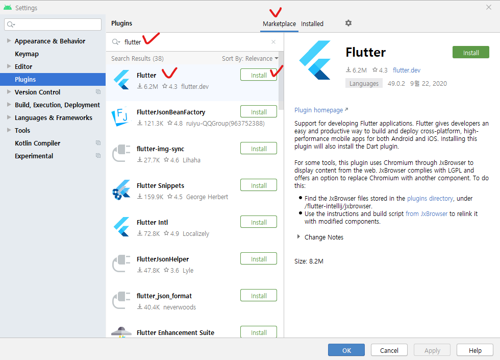

## 개발환경 설치
- [!] Android toolchain - develop for Android devices (Android SDK version 30.0.2)
    - ! Some Android licenses not accepted.  To resolve this, run: flutter doctor --android-licenses
    - 지시하는데로 ``` flutter doctor --android-licenses ``` 실행하여 accept 함
- [!] VS Code (version 1.49.2)
    - VS Code도 사용하고 싶으면 플러그인 설치하면 됨
- [!] Connected device
    - 안드로이드 에뮬레이터를 실행하거나 안드로이드 스마트폰을 USB로 연결하면 됨

## 개발환경 설치
- 모두 정상적으로 설치된 상황이면
```bash
C:\Users\jyheo>flutter doctor
Doctor summary (to see all details, run flutter doctor -v):
[√] Flutter (Channel stable, 1.20.4, on Microsoft Windows [Version 10.0.18363.1082], locale ko-KR)
[√] Android toolchain - develop for Android devices (Android SDK version 30.0.2)
[√] Android Studio (version 4.0)
[√] VS Code (version 1.49.2)
[√] Connected device (1 available)

• No issues found!
```

## 개발환경 동작 확인
- 안드로이드 스튜디오 실행
- File > New > New Flutter Project
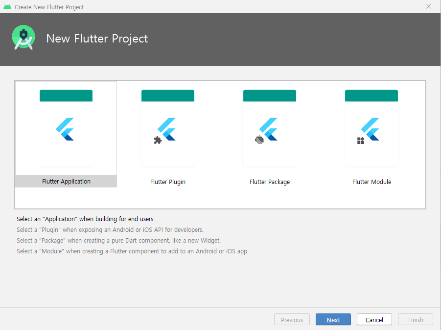

## 개발환경 동작 확인
- Flutter SDK 위치가 지정이 안되어 있다면 설치한 곳으로 지정
    - 여기에서는 c:\flutter
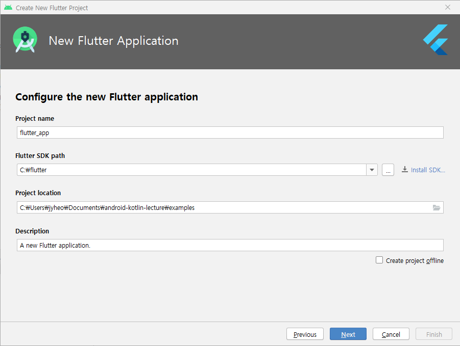

## 개발환경 동작 확인
- Finish 버튼 눌러서 프로젝트 생성


## 개발환경 동작 확인
- 안드로이드 스튜디오에서 Run > Run 'main.dart' 로 실행
- 에뮬레이터(또는 디바이스)에 실행되는 것 확인
    - 오른쪽 아래 + 버튼을 누르면 가운데 숫자 증가함
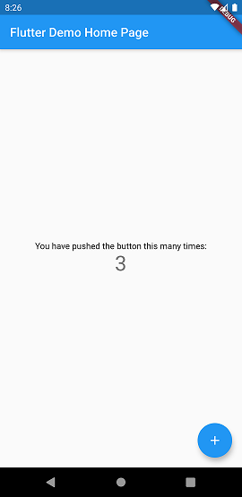

## 개발환경 동작 확인
- Hot Reload 테스트
- Flutter SDK는 다른 크로스플랫폼 개발 환경들과 마찬가지로 hot reload를 제공
- 코드를 수정하면 바로 실행 프로그램에 반영되는 것
- lib/main.dart 파일을 오픈 MyHomePage 호출 부분에서 title의 내용을 바꾼 후 저장해보면 바로 실행 화면에 바뀌는 것을 확인 가능
  ```dart
  class MyApp extends StatelessWidget {
    // This widget is the root of your application.
    @override
    Widget build(BuildContext context) {
      return MaterialApp(
        title: 'Flutter Demo',
        theme: ThemeData(
          primarySwatch: Colors.blue, visualDensity: VisualDensity.adaptivePlatformDensity,
        ),
        home: MyHomePage(title: 'Flutter Demo Home Page'),
      );
    }
  }
  ```
## 개발환경 동작 확인
- Hot Reload 테스트
- 'Flutter Demo Home Page' 대시 'Hello, Flutter' 로 변경 후 저장
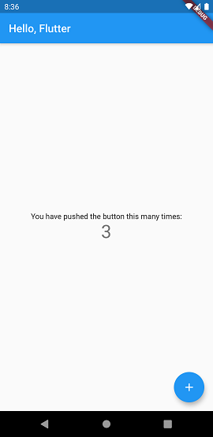


## Flutter UI 구조
- 위젯(Widget)의 계층 구조로 UI 레이아웃을 구성
    - React와 비슷
- 위젯은 데이터나 상태 같은 것을 보여주는 UI 기본 구성 요소
- 데이터나 상태가 변경되면 보여주는 해당 위젯을 업데이트함
- 기본 위젯
    - Text: 텍스트 표시
    - Row, Column: 가로 또는 세로로 다른 위젯들을 배치
    - Stack: 위젯들을 겹쳐 쌓아올리는 형태로 배치
    - Container: 다른 위젯을 감싸고 여백 등을 줄 수 있음
- 머티리얼 위젯(Material Widgets)
    - 기본 위젯을 포함하고 머티리얼 디자인(Material Design)을 따르도록 만들어진 것
    - import 'package:flutter/material.dart';

## Hello, Flutter
```dart
import 'package:flutter/material.dart';

void main() {
  runApp(
    Text(
      'Hello, Flutter!',
      textDirection: TextDirection.ltr,
    )
  );
}
```
- import 는 필요한 위젯 라이브러리 import
- main() 은 Dart 언어에서 프로그램의 시작 함수임
- runApp(Widget) 은 인자로 받은 Widget을 메인 화면에 표시
- Text() 는 텍스트를 표시하기 위한 위젯을 생성
    - 여기에서는 'Hello, Flutter!'라는 글자를 표시

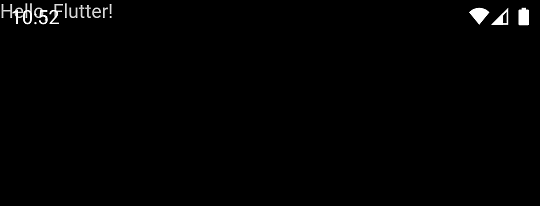

## Hello, Flutter
- Align을 지정하지 않아 화면 좌상단에 Text()가 표시됨 
- Align을 줄 수 있는 위젯 추가(예: Center)
- Text의 색을 변경하기 위한, TextStyle()을 추가
  ```dart
  import 'package:flutter/material.dart';

  void main() {
    runApp(
      Center(
        child: Text(
          'Hello, Flutter!',
          textDirection: TextDirection.ltr,
          style: TextStyle(color: Colors.red, fontSize: 30)
        )
      )
    );
  }
  ```

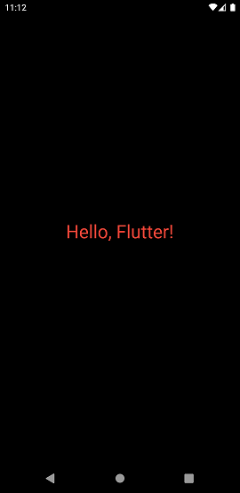

## Hello, Flutter
- 머티리얼 디자인을 적용하여 앱 만들기
- MaterialApp()
  - AppBar, Scaffold 등 머티리얼 디자인을 따르는 다양한 위젯을 사용할 수 있음
  ```dart
  import 'package:flutter/material.dart';                                

  void main() {
    runApp(
      MaterialApp(
        title: 'test',
        home: Scaffold(
          appBar: AppBar(
            title: Text('AppBar Title')
          ),
          body: Center(
            child: Text('Hello, Flutter!')
          )
        )
      )
    );
  }
  ```

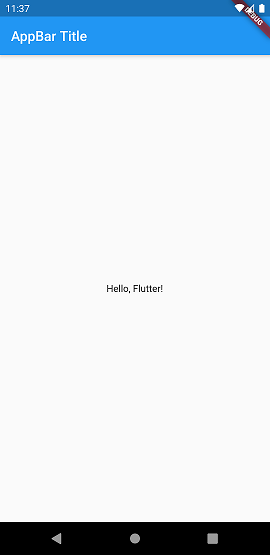

## Hello, Flutter - 완성
- StatelessWidget vs. StatefullWidget (뒤에서 좀 더 설명함)
- 두 위젯 중 하나를 상속하여 커스텀 위젯을 만드는 형태로 UI를 작성하는게 일반적
  - build() 메소드를 재정의 하여 커스텀 위젯을 만듬
```dart
import 'package:flutter/material.dart';
class MyApp extends StatelessWidget { // StatelessWidget을 상속하여 만듬, Hot Reload 동작함.
  @override
  Widget build(BuildContext context) {
    return MaterialApp(
        title: 'test',
        home: Scaffold(
            appBar: AppBar(   title: Text('AppBar Title')   ),
            body: Center(   child: Text('Hello, Flutter!')    )
        )
    );
  } 
}

void main() => runApp(MyApp());  // 한줄 함수는 이렇게 작성 가능함
```


## 레이아웃
- 레이아웃 위젯은 1개 또는 여러개의 자식을 포함할 수 있는 위젯으로 자식 위젯의 배치 방법을 결정함
  - 앞의 Center()와 같은 레이아웃 위젯은 하나의 자식을 포함하고, 자식 위젯의 위치를 중앙으로 배치함
  - Row()나 Column() 같은 레이아웃 위젯은 여러개의 자식 배치를 결정함
    - Row는 가로, Column은 세로 방향으로 자식 위젯을 배치
    - 안드로이드 SDK에서 LinearLayout의 horizontal, vertical과 비슷함
  - 참고) https://flutter.dev/docs/development/ui/widgets/layout


## 레이아웃 - Row() 사용 예제
```dart
import 'package:flutter/material.dart';

class MyApp extends StatelessWidget {
  @override
  Widget build(BuildContext context) {
    return MaterialApp(
        title: 'test',
        home: Scaffold(
            appBar: AppBar(title: Text('AppBar Title')),
            body: Row(
              mainAxisAlignment: MainAxisAlignment.spaceEvenly,
              children: [
                Expanded(child: Image.asset('assets/images/android.png')),
                Expanded(flex: 2, child: Text('Hello, Flutter!', textAlign: TextAlign.center,)),
                Expanded(child: Image.asset('assets/images/android_hsu.png')),
              ],
            )
        )
    );
  }
}

void main() => runApp(MyApp());
```

## 레이아웃 - Row() 사용 예제
- Scaffold의 body 인자로 Row()를 생성하여 전달
- Row()는 children인자로 받은 위젯들을 가로 방향으로 배치함
  - 이 예에서는 Image, Text, Image가 이에 해당됨
  - mainAxisAlignment 인자로 자식 위젯들의 가로 방향 공간 할당 방법을 지정함
  - crossAxisAlignment 인자로 자식 위젯들의 세로 방향 공간 할당 방법
    - Column()의 경우는 main이 세로, cross가 가로 방향임
- Expanded()는 공간에 맞춰 위젯의 크기를 조절하는 위젯
  - flex 인자를 통해 형제 위젯들과의 공간 비율을 조절할 수 있음
  - 이 예에서는 Text가 flex: 2이고 나머지는 1로 취급하여 Text가 Image들보다 2배 공간을 차지함


## 레이아웃 - Row() 사용 예제
- 이미지 등 assets 위치 지정
  - 프로젝트 루트에 있는 pubspec.yaml  에 assets에 assets/images/ 추가
  - 프로젝트 루트에 assets/images/ 폴더 밑에 이미지 파일 복사
  ```yaml
  flutter:
    ... 생략 ...
    assets:
      - assets/images/
  ```
- 다른 레이아웃에(ListView, GridView, CardView 등) 대한 정보
  - https://flutter.dev/docs/development/ui/layout
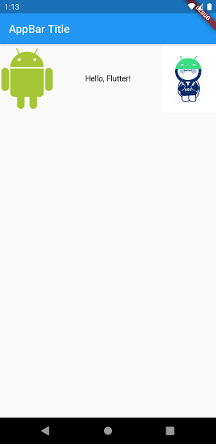


## 버튼(RaisedButton)
```dart
import 'package:flutter/material.dart';

class MyBody extends StatelessWidget {
  @override
  Widget build(BuildContext context) {
    return Center(child: Column(
      mainAxisAlignment: MainAxisAlignment.center,
      children: [
        Text("Hello, Flutter"),
        RaisedButton(
            child:Text('Click Me!'),
            onPressed: () => Scaffold.of(context).showSnackBar(
                SnackBar(content: Text("Snackbar! better than Toast!"),)),
        ),
      ],
    ));
  }
}
```

## 버튼(RaisedButton)
```dart
class MyApp extends StatelessWidget {
  @override
  Widget build(BuildContext context) {
    return MaterialApp(
        title: 'test',
        home: Scaffold(
            appBar: AppBar(title: Text('AppBar Title')),
            body: MyBody()
        )
    );
  }
}

void main() => runApp(MyApp());
```
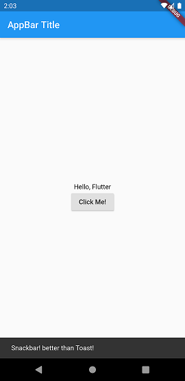


## 버튼(RaisedButton)
- RaisedButton()도 다른 위젯 처럼 생성하면 됨
- onPressed 인자로 버튼이 눌렸을 때 호출될 함수를 지정할 수 있음
  - ``` onPressed: _someFunction ```
  - 이 예제에서는 람다 함수 사용
  - (인자 리스트) { 함수 정의 }
    - ``` onPressed: () { Scaffold.of(conte  ...     st!"),)); } ```
  - (인자 리스트) => 한줄 함수
    - ``` onPressed: () => Scaffold.of(conte  ...     st!"),)), ```


## 상태 저장
- StatelessWidget vs. StatefullWidget
- StatelessWidget은 상태가 변하지 않음
  - 예) Icon, IconButton Text
  - StatelessWidget을 상속하여 만듬
- StatefullWidget은 사용자 인터랙션이나 데이터를 받음에 따라 상태가 동적으로 변함
  - 예) Checkbox, Radio, Slider, InkWell, Form, TextField
  - StatefulWidget과 State<>를 상속하여 커스텀 위젯을 만듬
  - 사용자가 관리할 상태들을 State 객체에 저장되고, 상태가 바뀌면 setState()를 호출하여 시스템이 위젯을 다시 그리도록 함


## 상태 저장 - TextField
```dart
import 'package:flutter/material.dart';

class _MyFormState extends State<MyForm> {
  TextEditingController textEditingController  = TextEditingController();
  String displayedText = 'Hello, Flutter';

  @override
  Widget build(BuildContext context) {
    return Center(
        child: Column(
      mainAxisAlignment: MainAxisAlignment.center,
      children: [
        Text(displayedText),
        TextField(controller: textEditingController),
        RaisedButton(
          child: Text("Change Text!"),
          onPressed: () => setState(() {
            displayedText = textEditingController.text;
          }),
        ),
      ],
    ));
  }
}
```

## 상태 저장 - TextField
```dart
class MyForm extends StatefulWidget {
  @override
  _MyFormState createState() => _MyFormState();
}

class MyApp extends StatelessWidget {
  @override
  Widget build(BuildContext context) {
    return MaterialApp(
      title: 'Button and TextField Test',
      home:
          Scaffold(appBar: AppBar(title: Text('AppBar Title')), body: MyForm()),
    );
  }
}

void main() => runApp(MyApp());
```
- TextField에 입력하고 버튼을 누르면 Text의 내용이 변경됨
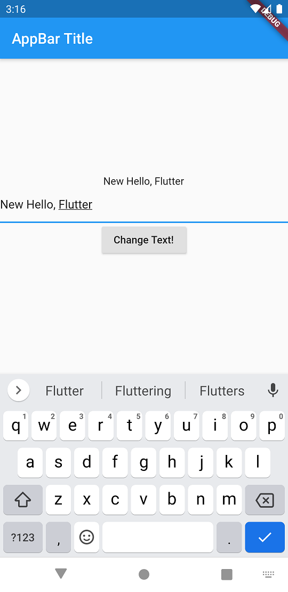


## 상태 저장 - TextField
- MyForm은 StatefullWidget을 상속하고 createState() 만 재정의 함
  - createState는 State<MyForm>을 상속한 _MyFormState 객체를 리턴하면 됨
- _MyFormState는 State<MyForm>을 상속하고 여기에서 커스텀 위젯을 만드는 build()를 재정의 함
- _MyFormState에는 build() 재정의 뿐 아니라 관리할 상태 값들을 관리함
  ```dart
  TextEditingController textEditingController  = TextEditingController();
  String displayedText = 'Hello, Flutter';
  ```
- RaisedButton이 눌렸을 때 처리하는 onPressed 인자로 전달된 람다 함수에서 setState() 호출하여 위젯 업데이트되도록 함
  ```dart
  onPressed: () => setState(() {
            displayedText = textEditingController.text;
          }),
  ```

## 네비게이션(Navigation)
- Navigation

## 앱 상태 관리
- ChangeNotifier


## 더 자세한 내용은
- https://flutter.dev/docs
  - Platform-specific 코드 작성 방법
  - 디버그 & 테스팅 방법
  - 앱 퍼블리시 방법
  - 기타 등등
