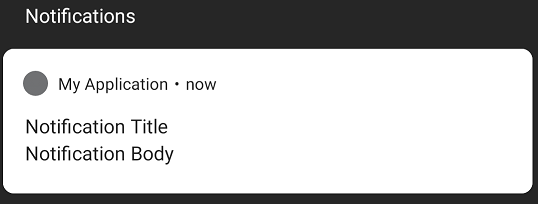
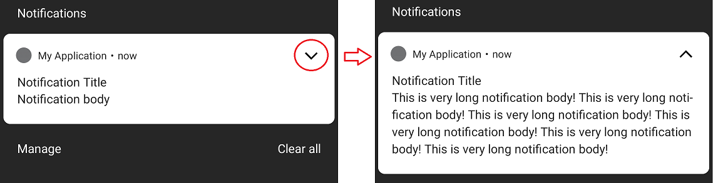
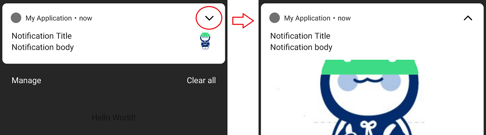
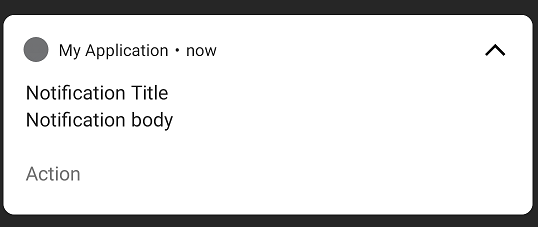
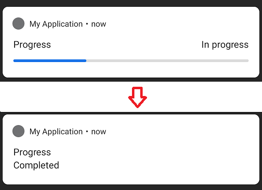

# 알림(Notification)
<!-- _class: lead -->
### 허준영(jyheo@hansung.ac.kr)

## 알림(Notification) 개요
- 앱의 UI와 별도로 사용자에게 앱과 관련한 정보를 보여주는 기능
- 알림을 터치하여 해당 앱을 열거나, 
    - 바로 간단한 작업(예: 문자 답하기)을 할 수 있음(Android 7.0부터)
- 보통 단말기 상단 부분에 표시되고,
    - 앱 아이콘의 배지로도 표시(Android 8.0부터)
 


## NotificationCompat
- 알림은 안드로이드가 버전에 따라 기능이 계속 추가되어 왔음
    - 여기에서는 안드로이드 8.0이상을 기준으로 이야기 하지만
    - 이전 버전에서도 동작할 수 있도록 support library의 NotificationCompat, NotificationManagerCompat 사용이 권장됨
- 이미 support library를 사용하고 있으면 별로도 gradle 수정할 필요 없음
    - ``` implementation 'androidx.appcompat:appcompat:1.2.0' ```


## 알림 채널(Android 8.0 이상)
- Android 8.0 이상의 경우는 알림을 만들기 전에 알림 채널을 먼저 만들어야 함
- 알림 채널은 알림을 그룹하여 알림 활성화나 방식을 변경할 수 있음
- 현재 앱이 실행 중인 안드로이드 버전을 확인하여 8.0 이상인 경우만 채널 생성
    - ``` Build.VERSION.SDK_INT >= Build.VERSION_CODES.O ```
    ```kotlin
    private val myNotificationID = 1
    private val channelID = "default"

    private fun createNotificationChannel() {
        if (Build.VERSION.SDK_INT >= Build.VERSION_CODES.O) { // Android 8.0
            val channel = NotificationChannel(channelID, "default channel",
                NotificationManager.IMPORTANCE_DEFAULT)
            channel.description = "description text of this channel."
            val notificationManager = getSystemService(Context.NOTIFICATION_SERVICE) as NotificationManager
            notificationManager.createNotificationChannel(channel)
        }
    }
    ```

## 알림 생성
* NotificationCompat.Builder 객체에서 알림에 대한 UI 정보와 작업을 지정
    - setSmallIcon(): 작은 아이콘
    - setContentTitle(): 제목
    - setContentText(): 세부 텍스트
* NotificationCompat.Builder.build() 호출
    - Notification 객체를 반환
* NotificationManagerCompat.notify()를 호출해서 시스템에 Notification 객체를 전달

## 단순 알림 생성
- 단순 알림 생성, notify()
    ```kotlin
    private val myNotificationID = 1

    private fun showNotification() {
        val builder = NotificationCompat.Builder(this, channelID)
            .setSmallIcon(R.mipmap.ic_launcher)
            .setContentTitle("title")
            .setContentText("notification text")
            .setPriority(NotificationCompat.PRIORITY_DEFAULT)
        NotificationManagerCompat.from(this).notify(myNotificationID, builder.build())
    }
    ```
    - myNotificationID 값을 다르게 주고 notify()를 호출하면 알림이 또 표시됨
    


## 알림 중요도
- 채널 중요도(Android 8.0 이상)
    ```kotlin
    NotificationChannel(channelID, "default channel", NotificationManager.IMPORTANCE_DEFAULT) 
    ```
- 알림 우선순위(Android 7.1 이하)
    ```kotlin
    NotificationCompat.Builder(this, channelID).setPriority(NotificationCompat.PRIORITY_DEFAULT)
    ```
- 채널/알림 중요도/우선순위 수준
    |중요도 | 설명    | 중요도(Android 8.0 이상)      | 우선순위(Android 7.1 이하) |
    |-------|---------|----------------------|----------------------------|
    | 긴급  | 알림음이 울림, 헤드업 알림 표시 | IMPORTANCE_HIGH | PRIORITY_HIGH |
    | 높음  | 알림음이 울림                 | IMPORTANCE_DEFAULT | PRIORITY_DEFAULT |
    | 중간  | 알림음이 없음                 | IMPORTANCE_LOW | PRIORITY_LOW |
    | 낮음  | 알림음이 없음, 상태 표시줄에 표시 안됨|IMPORTANCE_MIN | PRIORITY_MIN |


## 알림에 확장 뷰
- 긴 텍스트를 추가한 확장 뷰를 알림에 넣을 수 있음
    ```kotlin
    builder.setStyle(NotificationCompat.BigTextStyle()
                    .bigText(resources.getString(R.string.long_notification_body)))
    ```
    


## 알림에 확장 뷰
- 그림 넣은 확장 뷰
    ```kotlin
    val bitmap = BitmapFactory.decodeResource(resources, R.drawable.android_hsu)
    val builder = NotificationCompat.Builder(this, channelID)
        .setSmallIcon(R.mipmap.ic_launcher)
        .setLargeIcon(bitmap)
        .setContentTitle("Notification Title")
        .setContentText("Notification body")
        .setPriority(NotificationCompat.PRIORITY_DEFAULT)
        .setStyle(NotificationCompat.BigPictureStyle()
            .bigPicture(bitmap)
            .bigLargeIcon(null))  // hide largeIcon while expanding
    ```
    


## 알림에 버튼 추가
- 알림에 버튼을 추가하고 버튼을 누르면 Intent로 Activity나 Broadcast를 시작함
    - Action 버튼을 누르면 TestActivity가 시작됨
    ```kotlin
    val intent = Intent(this, TestActivity::class.java)
    val pendingIntent = PendingIntent.getActivity(this, 0, intent, 0)
    val builder = NotificationCompat.Builder(this, channelID)
        .setSmallIcon(R.mipmap.ic_launcher)
        .setContentTitle("Notification Title")
        .setContentText("Notification body")
        .setPriority(NotificationCompat.PRIORITY_DEFAULT)
        .addAction(R.drawable.android_hsu, "Action", pendingIntent)
    NotificationManagerCompat.from(this).notify(myNotificationID, builder.build())
    ```
    


## 알림에 프로그래스 표시
- 알림에 프로그래스 바를 표시
    ```kotlin
    val builder = NotificationCompat.Builder(this, channelID)
        .setSmallIcon(R.mipmap.ic_launcher)
        .setContentTitle("Progress")
        .setContentText("In progress")
        .setProgress(100, 0, false)
        .setPriority(NotificationCompat.PRIORITY_DEFAULT)
    NotificationManagerCompat.from(this).notify(myNotificationID, builder.build())

    Thread {  // 스레드로 프로그래스바 업데이트
        for (i in (1..100).step(10)) {
            Thread.sleep(1000)
            builder.setProgress(100, i, false)
            NotificationManagerCompat.from(this)\
                .notify(myNotificationID, builder.build())
        }
        builder.setContentText("Completed")
            .setProgress(0, 0, false)    // max=0이면 프로그래스바 사라짐
        NotificationManagerCompat.from(this)
            .notify(myNotificationID, builder.build())  // 같은 ID로 notify
    }.start()
    ```




## 알림에 액티비티 연결하기
* 알림을 터치하면 연결된 액티비티가 실행되도록 하는 것
    - PendingIntent 사용
    - 연결된 액티비티가 일반 액티비티, 알림 전용 액티비티인지에 따라 백스택 관리가 달라짐
* 일반 액티비티: 일반적인 앱의 액티비티임
    - 사용자가 앱을 사용하면서 액티비티를 시작시키는 것과 유사하게 백스택을 관리
* 알림 전용 액티비티: 알림하고만 연결되어 실행 가능한 액티비티로 알림을 확장 하는 개념
    - 사용자가 다른 방법으로 시작하지는 못하게 함


## 알림에 액티비티 연결하기 - 일반 액티비티
* 알림을 터치하면 일반 액티비티인 SecondActivity가 시작
* AndroidManifest.xml의 SecondActivity 정의 부분
    ```xml
    <activity android:name=".SecondActivity"
            android:parentActivityName=".MainActivity">
    </activity>
    ```
* PendingIntent 생성하고 알림 등록
    ```java
    Intent intent = new Intent(this, SecondActivity.class);
    TaskStackBuilder stackBuilder = TaskStackBuilder.create(this);
    stackBuilder.addParentStack(SecondActivity.class);
    stackBuilder.addNextIntent(intent);
    PendingIntent pIntent = stackBuilder.getPendingIntent(0, PendingIntent.FLAG_UPDATE_CURRENT);
    mBuilder.setContentIntent(pIntent);
    mBuilder.setAutoCancel(true);
    mNotificationManagerCompat.notify(MY_NOTIFICATION_ID, mBuilder.build());
    ```


## 알림에 액티비티 연결하기 - 알림 전용 액티비티
* 알림을 터치하면 알림 전용 액티비티인 TempActivity가 시작됨
* AndroidManifest.xml의 TempActivity 정의 부분
    ```xml
    <activity android:name=".TempActivity"
                android:taskAffinity=""
                android:excludeFromRecents="true">
    </activity>
    ```
* PendingIntent 생성하고 알림 등록
    ```java
    Intent intent = new Intent(this, TempActivity.class);
    intent.setFlags(Intent.FLAG_ACTIVITY_NEW_TASK | Intent.FLAG_ACTIVITY_CLEAR_TASK);
    PendingIntent pIntent = PendingIntent.getActivity(this, 0, intent, PendingIntent.FLAG_UPDATE_CURRENT);
    mBuilder.setContentIntent(pIntent);
    mBuilder.setAutoCancel(true);
    mNotificationManagerCompat.notify(MY_NOTIFICATION_ID, mBuilder.build());
    ```


## 참고 링크
- https://developer.android.com/guide/topics/ui/notifiers/notifications?hl=ko
- https://developer.android.com/training/notify-user/build-notification?hl=ko


## 실습
- 아래의 요구사항을 만족하는 알림을 만든다.
- 요구사항
    - 메뉴를 만든다.
    - 메뉴 항목에는 알림1, 알림2
    - 알림1과 알림2는 서로 다른 알림 채널로 알림을 보낸다.
- 실행
    - 알림1을 누르면 