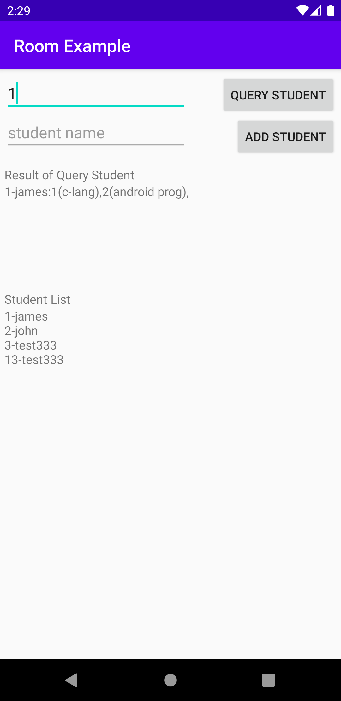

# Room 
<!-- _class: lead -->
### 허준영(jyheo@hansung.ac.kr)


## Room 개요
- Room
    - SQLite를 쉽게 사용할 수 있는 데이터베이스 객체 매핑 라이브러리SQL
    - 쉽게 Query를 사용할 수 있는 API를 제공
    - Query를 컴파일 시간에 검증함
    - Query결과를 LiveData로하여 데이터베이스가 변경될 때 마다 쉽게 UI를 변경할 수 있음
- SQLite 보다 Room을 사용할 것을 권장함


## Room 주요 3요소
- Room의 주요 3요소
    - **@Database**: 클래스를 데이터베이스로 지정하는 annotation, RoomDatabase를 상속 받은 클래스여야 함
        - Room.databaseBuilder를 이용하여 인스턴스를 생성함
    - **@Entity**: 클래스를 테이블 스키마로 지정하는 annotation
    - **@Dao**: 클래스를 DAO(Data Access Object)로 지정하는 annotation
        - 기본적인 insert, delete, update SQL은 자동으로 만들어주며, 복잡한 SQL은 직접 만들 수 있음


## gradle 파일 설정
- Room은 안드로이드 아키텍처에 포함되어 있음
- 사용하기위해 build.gradle 파일의 dependencies에 아래 내용을 추가해야 함
    - Androidx 사용하는 경우를 가정함, Android Studio와 SDK는 최신 버전으로 사용
    - 'kotlin-kapt' 플러그인이 빠져있으면 추가 (``` apply plugin 'kotlin-kapt' ```)
    ```gradle
    apply plugin: 'kotlin-kapt'
    ...
    dependencies {
        ...
        def room_version = "2.2.5"
        implementation "androidx.room:room-runtime:$room_version"
        kapt "androidx.room:room-compiler:$room_version"
        // optional - Kotlin Extensions and Coroutines support for Room
        implementation "androidx.room:room-ktx:$room_version"
        // optional - Test helpers
        testImplementation "androidx.room:room-testing:$room_version"
    }
    ```


## Entity 생성
- Entity는 테이블 스키마 정의
- CREATE TABLE student_table (student_id INTEGER PRIMARY KEY, name TEXT NOT NULL); 
- @Entity data class Student
    ```kotlin
    @Entity(tableName = "student_table")    // 테이블 이름을 student_table로 지정함
    data class Student (
        @PrimaryKey @ColumnInfo(name = "student_id") val id: Int,
        val name: String
    )
    ```
    - data class 사용하면 편리
    - @PrimaryKey로 프라이머리 키 지정
    - @ColumnInfo로 실제 테이블 스키마에서 사용할 이름을 지정할 수 있음


## Entity 생성
```kotlin
@Entity(tableName = "class_table")
data class ClassInfo (
    @PrimaryKey val id: Int,
    val name: String,
    val day_time: String,
    val room: String,
    val teacher_id: Int
)
```
- @Entity(table_name = "") 으로 실제 테이블 이름을 지정할 수 있음
- @PrimaryKey(autoGenerate = true) 를 하면 키를 자동으로 생성하게 할 수 있음


## Entity 생성
```kotlin
@Entity(tableName = "enrollment",
    primaryKeys = ["sid", "cid"],
    foreignKeys = [
        ForeignKey(entity = Student::class, parentColumns = ["student_id"], childColumns = ["sid"]),
        ForeignKey(entity = ClassInfo::class, parentColumns = ["id"], childColumns = ["cid"])
    ]
)
data class Enrollment (
    val sid: Int,
    val cid: Int,
    val grade: String? = null
)
```
- @Entity의 primaryKeys와 foreignKeys 인자를 통해 프라이머리 키와 외래 키를 지정할 수 있음
- 외래키는 관련된 외부 부모 Entity와 컬럼(parentColumns)을 지정하고, 외래키 컬럼(childColumns)을 지정


## DAO 생성
- DAO는 interface나 abstract class로 정의되어야 함
- Annotation에 SQL 쿼리를 정의하고 그 쿼리를 위한 메소드를 선언
- 가능한 annotation으로 @Insert, @Update, @Delete, @Query가 있음
    - ```@Query("SELECT * from table") fun getAllData() : List<Data>```
- @Insert, @Update, @Delete는 SQL 쿼리를 작성하지 않아도 컴파일러가 자동으로 생성함    
    - @Insert나 @Update는 key가 중복되는 경우 처리를 위해 onConflict를 지정할 수 있음
        - OnConflictStrategy.ABORT: key 충돌시 종료
        - OnConflictStrategy.IGNORE: key 충돌 무시
        - OnConflictStrategy.REPLACE: key 충돌시 새로운 데이터로 변경
    - @Update나 @Delete는 primary key에 해당되는 튜플을 찾아서 변경/삭제 함
    

## DAO 생성
- @Query로 리턴되는 데이터의 타입을 LiveData<>로 하면, 나중에 이 데이터가 업데이트될 때 Observer를 통해 할 수 있음
    - ```@Query("SELECT * from table") fun getAllData() : LiveData<List<Data>> ```
- @Query에 SQL을 정의할 때 메소드의 인자를 사용할 수 있음
    ```
    @Query("SELECT * FROM student_table WHERE name = :sname")
    suspend fun getStudentByName(sname: String): List<Student>
    ```
    - 인자 sname을 SQL에서 :sname으로 사용
- fun 앞에 suspend는 Kotlin coroutine을 사용하는 것임, 나중에 이 메소드를 부를 때는 runBlocking {} 내에서 호출해야 함 
- LiveData는 비동기적으로 동작하기 때문에 coroutine으로 할 필요가 없음

<!--
- LiveData는 Android architecture component로 안드로이 앱의 구조를 잘 설계하도록 도와주는 라이브러리들이다.
- Android Jetpack에 포함되어, 안드로이드 버전과 상관 없이 업데이트가 됨
- https://developer.android.com/topic/libraries/architecture/
-->


## DAO 생성
```kotlin
@Dao
interface MyDAO {
    @Insert(onConflict = OnConflictStrategy.REPLACE)  // INSERT, key 충돌이 나면 새 데이터로 교체
    suspend fun insertStudent(student: Student)

    @Query("SELECT * FROM student_table")
    fun getAllStudents(): LiveData<List<Student>>        // LiveData<> 사용

    @Query("SELECT * FROM student_table WHERE name = :sname")   
    suspend fun getStudentByName(sname: String): List<Student>

    @Delete
    suspend fun deleteStudent(student: Student); // primary key is used to find the student

    @Transaction
    @Query("SELECT * FROM student_table WHERE student_id = :id")
    suspend fun getStudentsWithEnrollment(id: Int): List<StudentWithEnrollments>

    // ...
}
```


## Database 생성
- RoomDatabase를 상속하여 자신의 Room 클래스를 만들어야 함
- 포함되는 Entity들과 데이터베이스 버전(version)을 @Database annotation에 지정함
    - version이 기존에 저장되어 있는 데이터베이스보다 높으면, 데이터베이스를 open할 때 migration을 수행하게 됨
    - Migration 수행 방법은 RoomDatabase 객체의 addMigration() 메소드를 통해 알려줌
- DAO를 가져올 수 있는 getter 메소드를 만듬
    - 실제 메소드 정의는 자동으로 생성됨
- Room 클래스의 인스턴스는 하나만 있으면 되므로 Singleton 패턴을 사용
- Room 클래스의 객체 생성은 Room.databaseBuilder()를 이용함


## Database 생성
```kotlin
@Database(entities = [Student::class, ClassInfo::class, Enrollment::class, Teacher::class], version = 1)
abstract class MyDatabase : RoomDatabase() {
    abstract fun getMyDao() : MyDAO

    companion object {
        private var INSTANCE: MyDatabase? = null
        private val MIGRATION_1_2 = object : Migration(1, 2) {
            override fun migrate(database: SupportSQLiteDatabase) { 생략 }
        }

        private val MIGRATION_2_3 = object : Migration(2, 3) {
            override fun migrate(database: SupportSQLiteDatabase) { 생략 }
        }
        fun getDatabase(context: Context) : MyDatabase {
            if (INSTANCE == null) {
                INSTANCE = Room.databaseBuilder(
                    context, MyDatabase::class.java, "school_database")
                    .addMigrations(MIGRATION_1_2, MIGRATION_2_3)
                    .build()
            }
            return INSTANCE as MyDatabase
        }
    }
}
```


## Migration
- 앞에서 MyRoomDatabase객체 생성 후 addMigrations() 메소드를 호출하여 Migration 방법을 지정했음
    - 여러개의 Migration 지정 가능
    - ```Room.databaseBuilder(...).addMigrations(MIGRATION_1_2, MIGRATION_2_3) ```
    ```kotlin
    private val MIGRATION_1_2 = object : Migration(1, 2) {   // version 1 -> 2
        override fun migrate(database: SupportSQLiteDatabase) {
            database.execSQL("ALTER TABLE student_table ADD COLUMN last_update INTEGER")
        }
    }

    private val MIGRATION_2_3 = object : Migration(2, 3) {   // version 2 -> 3
        override fun migrate(database: SupportSQLiteDatabase) {
            database.execSQL("ALTER TABLE class_table ADD COLUMN last_update INTEGER")
        }
    }
    ```


## UI와 연결
- 안드로이드 아키텍처에 따라 Repository와 ViewModel을 사용하길 권장하지만
    - 참고: https://codelabs.developers.google.com/codelabs/android-room-with-a-view-kotlin/
    - 여기에서는 Room과 LiveData 사용만 다룸
- RoomDatabase객체에게 DAO 객체를 받아오고, 이 DAO객체의 메소드를 호출하여 데이터베이스를 접근함
    ```kotlin
    myDao = MyDatabase.getDatabase(this).getMyDao()
    runBlocking { // (주의) UI를 블록할 수 있는 DAO 메소드를 UI 스레드에서 바로 호출하면 안됨
        myDao.insertStudent(Student(1, "james"))  // suspend 지정되어 있음
    }
    val allStudents = myDao.getAllStudents() // LiveData는 Observer를 통해 비동기적으로 데이터를 가져옴
    ```


## UI와 연결 - LiveData
- LiveData<> 타입으로 리턴되는 DAO 메소드 경우
    - observe() 메소드를 이용하여 Observer를 지정
    - 데이터가 변경될 때마다 자동으로 Observer의 onChanged()가 호출됨
- LiveData<>를 리턴하는 DAO 메소드는 Observer를 통해 비동기적으로 데이터를 받기 때문에, UI 스레드에서 직접 호출해도 문제 없음
    ```kotlin
    val allStudents = myDao.getAllStudents()
    allStudents.observe(this) {   // Observer::onChanged() 는 SAM 이기 때문에 lambda로 대체
        val str = StringBuilder().apply {
                for ((id, name) in it) {
                    append(id)
                    append("-")
                    append(name)
                    append("\n")
                }
            }.toString()
        binding.textStudentList.text = str
    }
    ```


## 1:N 관계의 쿼리
- 앞에서 정의한 Student와 Enrollment 테이블에서 Student 1당 여러개의 Enrollment가 관계되어 있음
- Student를 쿼리할 때 관계된 Enrollment 목록도 쿼리하도록 만들려면...
    ```kotlin
    data class StudentWithEnrollments(  // 1:N 관계
        @Embedded val student: Student,
        @Relation(parentColumn = "student_id", entityColumn = "sid")
        val enrollments: List<Enrollment>
    )
    ```
    - (주의) Entity가 아님
    - @Embedded는 다른 클래스의 속성을 포함시키고 싶을 때 사용
    - @Relation은 1:N 관계에서 연관되는 column을 지정
        - parentColumn은 부모 entity의 프라이머리 키
        - entitlyColumn은 부모 entity의 프라이머리 키를 참조하는 자식 entity의 컬럼


## 1:N 관계의 쿼리 - DAO 생성
```kotlin
@Dao
interface MyDAO {
    // 생략

    @Transaction
    @Query("SELECT * FROM student_table WHERE student_id = :id")
    suspend fun getStudentsWithEnrollment(id: Int): List<StudentWithEnrollments>

    // ...
}
```
- @Transaction 애노테이션 필요, 왜냐하면 실제로 두개의 Query가 필요하기 때문에.
    - ``` "SELECT * FROM student_table WHERE student_id = :id" ```
    - ``` "SELECT * FROM enrollment WHERE sid = :id" ```


## 전체 예제 코드
- https://github.com/jyheo/android-kotlin-lecture/tree/master/examples/room




## sqlite3 in adb shell

```
C:\Users\jyheo>adb shell
generic_x86_arm:/ $ run-as com.example.room
generic_x86_arm:/data/user/0/com.example.room $ cd databases
generic_x86_arm:/data/user/0/com.example.room/databases $ ls
school_database  school_database-shm  school_database-wal
generic_x86_arm:/data/user/0/com.example.room/databases $ sqlite3 school_database
SQLite version 3.28.0 2020-05-06 18:46:38
Enter ".help" for usage hints.
sqlite> .table
android_metadata   enrollment         student_table
class_table        room_master_table  teacher_table
sqlite> .schema student_table
CREATE TABLE `student_table` (`student_id` INTEGER NOT NULL, `name` TEXT NOT NULL, PRIMARY KEY(`student_id`));
sqlite> select * from student_table;
1|james
2|john
3|test333
13|test333
sqlite>
```

## 실습
- 예제에서 학생 목록을 보여주기 위한 TextView 대신에 ListView나 RecyclerView를 사용하도록 수정 (30점)
- 목록에서 학생을 선택하면 [QUERY STUDENT] 버튼을 누른 것과 같이 학생 정보를 보여주도록 함 (20점)
- ENROLL, DELETE 버튼 추가
- 목록에서 학생을 선택한 상태에서 ENROLL 버튼을 누르면 (30점)
    - class_table에서 임의의 과목들과 학생의 id를 enrollment에 추가
- 목록에서 학생을 선택하고 DELETE 버튼을 누르면 선택 학생을 삭제 (20점)
